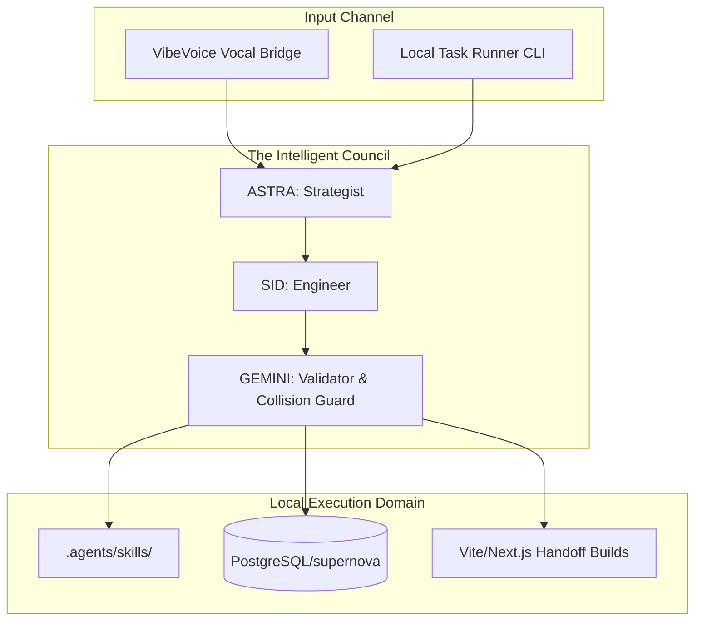

# 🌌 Brilliantaire OS: System Blueprint
> **Identity Stack:** King on his own board, Knight in the universe's game.  
> **Origin:** Area Boy (Lagos Roots) | **Symbolism:** Mr. 2 Lighter (Survival + Creation)  
> **Mindset:** Brilliantier (Pressure-educated) | **Signature:** *"I build before burning."*  

---

## 1. Executive Summary

**Brilliantaire OS** is a specialized sub-system within the **One System** mesh network. It serves as a tactical execution platform that operates with high-leverage local skills and autonomous decision-making loops. Engineered for pressure-packed developer scenarios, it balances creative output (vocal, music, narrative) with systematic code auditing, security guardrails, and automated verification.

---

## 2. Core Architecture

Brilliantaire OS operates on a three-tier execution hierarchy:

1. **Strategic Routing (ASTRA):** Converts vocal and CLI intents into structured task lists.
2. **Implementation Arm (SID):** Codes, builds, and deploys using project-local sandboxed skills.
3. **Verification Sentinel (GEMINI):** Runs 24/7 collision checking, lints code, and builds clean production outputs.

---

## 3. Technology Stack & Tools

* **Core Language:** TypeScript / Node.js
* **Build System:** `Taskfile.yml` for unified CLI scripting.
* **Orchestration:** Local `.agents/` workflows including VNP (Voice Narrative Protocol).
* **Integrations:**
  * **VibeVoice TTS/ASR Engine** for hands-free vocalization.
  * **GitHub CLI (`gh`)** for automated remote repository syncing.
  * **Postgres** (connected to the primary `supernova` schema).

---

## 4. Operational Protocols

### A. Voice Narrative Protocol (VNP)
Every major task must:
1. Announce intent: `bash .agents/voice_narrative.sh "Task Description"`
2. Execute safely under GEMINI collision rules.
3. Announce completion with sovereignty impact score: `announce_completion "Task Completed" <percentage_increment>`

### B. Preview Handoff Rule
No ephemeral localhost ports for UI reviews. Build production-ready artifacts (e.g. `dist/index.html` or similar static pages) and provide direct absolute URLs (`file:///...`).

### C. Build Before Burning
Never deploy, push, or declare a task done without validation. Running `task validate` is mandatory before completion.
