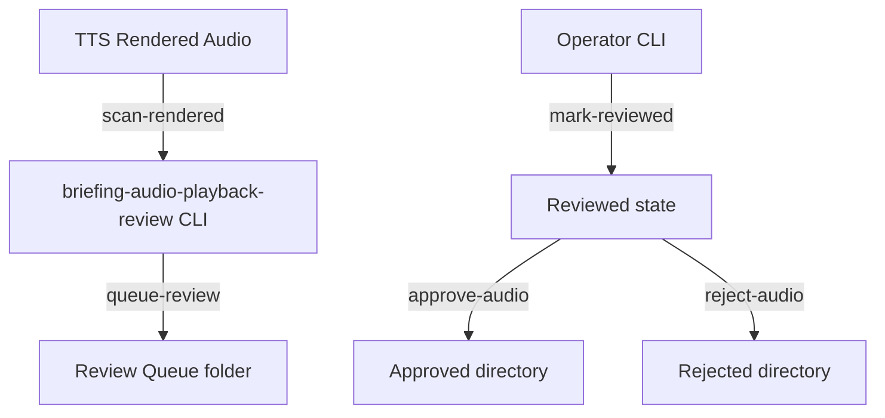

# 🔊 Briefing Audio Playback Review Gate (Phase N5M)

This document specifies the architectural layout, safety policies, command menu, and lifecycle statuses for the **Briefing Audio Playback Review Gate** (Phase N5M).

---

## 1. Architectural Layout

The Briefing Audio Playback Review Gate acts as a manual review layer separating compiled briefing audios from downstream export and narration routines. It guarantees that synthesized reports are audited, inspected, and verified before they are officially certified for usage.

---

## 2. Queue Transition States & Lifecycle

An audio briefing moves through the following chronological stages:
1. **UNSUBMITTED**: Audio exists in `outputs/narrator/tts_queue/rendered_audio/` but is not registered in the review gate.
2. **PENDING_REVIEW**: Audio is registered in `outputs/narrator/briefing_audio_playback_review/queue/` containing metadata indicating review queue status.
3. **REVIEWED**: Staged audio has been inspected by an administrator. This is a mandatory prerequisite status before approval can be granted.
4. **APPROVED**: Staged audio is verified and moved to `outputs/narrator/briefing_audio_playback_review/approved/`.
5. **REJECTED**: Staged audio is flagged as invalid and moved to `outputs/narrator/briefing_audio_playback_review/rejected/`. (Source audio remains untouched).

---

## 3. Core Safety Rules & Policies

* **No Autoplay**: No shell commands, players, or native APIs will run audio.
* **No Cloud Upload**: Audio packages are restricted to local volumes. External integrations are strictly disabled.
* **Strict Command Routing**: The router blocks fuzzy command queries and routes only exact command prefixes.
* **Non-destructive Rejections**: Rejecting briefing audio records a veto but leaves the source rendered audio intact for debugging.
* **Enforced Pre-requisites**: An audio file cannot be approved without first being flagged as reviewed.

---

## 4. Operational Command Menu

* `status`: Shows safety flags, paths, pending counts, and latest items.
* `scan-rendered`: Scans and lists only rendered briefing audio files.
* `inspect <AUDIO_ID>`: Shows path, size, format, rendering timestamps, and states.
* `queue-review <AUDIO_ID>`: Registers the rendered audio into the review queue.
* `mark-reviewed <AUDIO_ID>`: Flags the queued item as human-reviewed.
* `approve-audio <AUDIO_ID>`: Approves a reviewed item.
* `reject-audio <AUDIO_ID>`: Vetoes a queued item.
* `review-status <AUDIO_ID>`: Shows lifecycle details of a single item.
* `latest`: Prints the newest rendered or reviewed item.
* `review-summary`: Writes queue metrics to a markdown report.
* `review-log`: Prints recent review event histories.

---
“I build before burning.”
