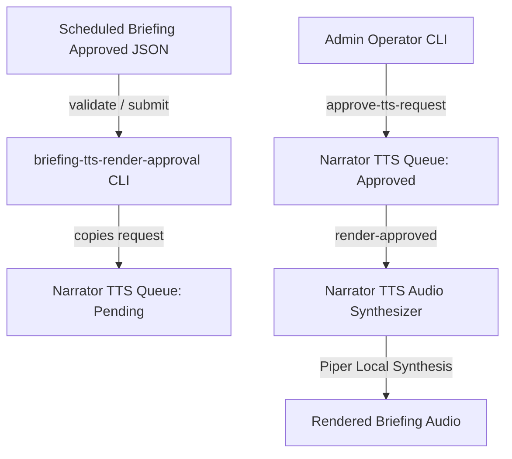

# 📋 Briefing TTS Render Approval Flow (Phase N5L)

This document specifies the architectural layout, safety constraints, command structures, and data flows for the **Briefing TTS Render Approval Flow** (Phase N5L). 

---

## 1. Architectural Layout

The Briefing TTS Render Approval Flow acts as a secure, gated bridge between the Scheduled Briefing Queue (Phase N5K) and the Narrator TTS Render Pipeline (Phases N5A & N5B). This flow guarantees that Daily Ops briefings are never synthesized into audio without explicit administrative validation and manual approval.

---

## 2. Queue Transition States & Data Flow

1. **Scheduled Briefing JSON**: Staged report briefings reside in `outputs/narrator/voice_ops_scheduled_briefing/approved/` or `queue/` as JSON packets containing extracted text summaries.
2. **Scan & Validate**: The approval flow scans generated TTS request markdown packets (`outputs/narrator/voice_ops_scheduled_briefing/tts_requests/`). It validates that:
   - The briefing metadata is marked `approved`.
   - The summary text length is within allowed constraints.
   - The briefing ID matches a strict format.
3. **Submit to TTS Queue**: Copies the briefing TTS request to `outputs/narrator/tts_queue/requests/` (and tracks it in `outputs/narrator/briefing_tts_render_approval/submitted/`) under the `pending_manual_approval` status. **No audio synthesis occurs during submission.**
4. **Approve TTS Request**: An operator manually executes approval, transitioning the request into `outputs/narrator/tts_queue/approved/` and `outputs/narrator/briefing_tts_render_approval/approved/`.
5. **Render Handoff**: The operator triggers `render-approved`, which reads the approved file, verifies the signature/status, calls the official Local Piper TTS script, and outputs the audio file into the local rendered directories.

---

## 3. Core Safety Rules & Policies

* **No Auto-Rendering**: Staging or submitting requests to the queue must not trigger automatic audio generation. Synthesis must wait for explicit operator approval.
* **No Auto-Playback**: No player execution or output sound is produced. Audio files are saved and cached quietly.
* **Local Containment**: All pipelines use offline resources (Piper, ggml-base.en, local models). External Cloud APIs are strictly disabled.
* **Strict Command Routing**: Only exact command sequences in the Safe Command Router are permitted. Fuzzy names, aliases, and shell commands are blocked.
* **Read-only Source Reports**: Original Daily Operating Reports are never altered or deleted during this process.

---

## 4. Operational Command Menu

All command arguments are routed via exact-name mapping:
* `status`: Displays current directories, safety gates, and state counts.
* `scan-tts-requests`: Lists generated briefing request files ready for flow onboarding.
* `inspect <BRIEFING_ID>`: Shows briefing details, text summary, and status.
* `validate <BRIEFING_ID>`: Verifies formatting, source approval state, and size.
* `submit-to-tts-queue <BRIEFING_ID>`: Transfers the briefing to the Narrator TTS Render queue.
* `approve-tts-request <BRIEFING_ID>`: Authorizes the pending TTS request.
* `render-approved <BRIEFING_ID>`: Invokes Piper synthesizer on the approved request.
* `render-status <BRIEFING_ID>`: Returns detailed rendering trace state.
* `latest`: Details the newest briefing queue item.
* `queue-summary`: Compiles metrics to a summary report.
* `render-log`: Prints recent rendering event logs.

---
“I build before burning.”
