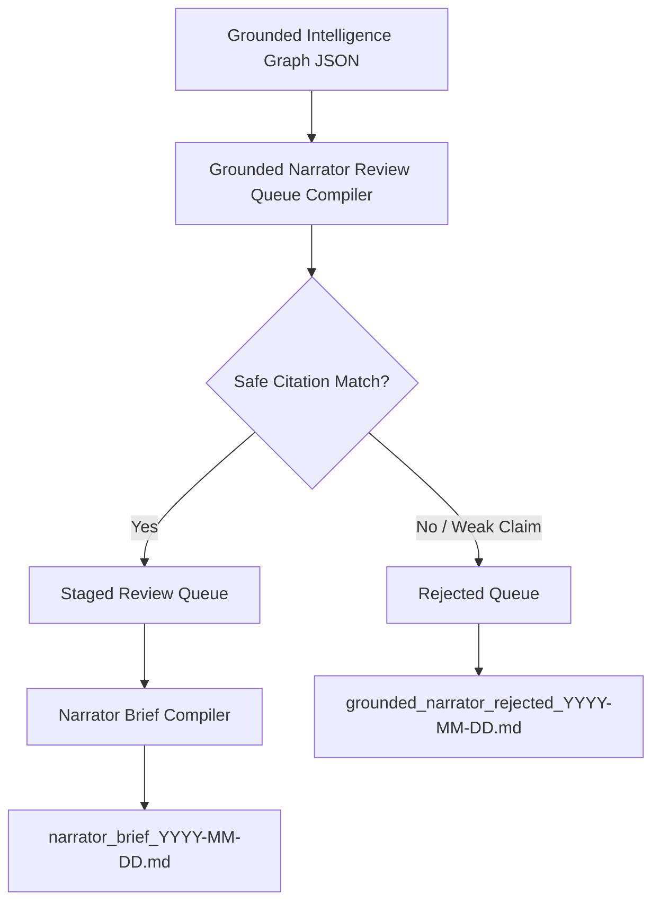

# 🎙️ Grounded Narrator Review Queue

## 🌌 Purpose
The **Grounded Narrator Review Queue** reads the grounded intelligence graph and prepares safe, citation-aware narration candidates for the offline narrator system. It acts as a safety gate between raw response insights and speech synthesis, ensuring everything narrated is fully traceable to verified local documentation.

---

## 🛠️ Safety Boundaries & System Constraints
This processor is governed by the following strict offline rules:
1. **Review-Only Mode:** Narration candidates are only compiled and staged for manual review. No audio files are generated.
2. **No TTS Generation:** Text-to-Speech (TTS) tools (e.g. Piper, say, or any API) must never be executed or triggered by this phase.
3. **No External APIs:** No network connections or remote services are queried.
4. **No Obsidian Writes:** Staged briefs and reports are kept under `outputs/` for review and are not written to Obsidian.
5. **Traceability Rule:** Only nodes with clear citations or source file mappings are eligible for staging into narrator briefs. Weak claims and high-risk nodes are systematically filtered out.
6. **No Auto-Tasks:** Candidate nodes are never automatically routed into active NEXT_ACTIONS task lists without developer review.
7. **Safe Command Router:** All commands must run through the pre-approved Command Router gates.

---

## 📂 Graph-to-Narrator Flow


---

## 📊 Review Statuses
- `ready_for_narrator_review`: Fully citation-mapped candidate ready for brief staging.
- `needs_source_check`: Candidate missing explicit citations but has source file references.
- `too_weak`: Candidate matching weak claims or policy violations.
- `rejected`: Flagged as high risk and blocked from narration.
- `approved_for_future_tts`: Manually signed-off candidate ready for the next TTS engine phase.

---

## ⌨️ Command Reference

Execute commands through the Safe Command Router:

### Help Menu
```bash
npm run command -- "grounded-narrator-review-help"
```

### Staged Candidates Queue
```bash
npm run command -- "grounded-narrator-review queue"
```

### Stage Narration Brief
```bash
npm run command -- "grounded-narrator-review brief"
```

### Compile Rejected Weak Claims
```bash
npm run command -- "grounded-narrator-review reject-weak"
```

### Queue Status Report
```bash
npm run command -- "grounded-narrator-review report"
```

### Status Summary
```bash
npm run command -- "grounded-narrator-review status"
```

---

## 🔮 Future TTS Boundary
Once a narration brief has been manually inspected and approved by the operator, it can be passed to the TTS Brief Composer and speech rendering engine (Piper) in a subsequent phase. This separation ensures zero hallucinated audio is ever generated.
