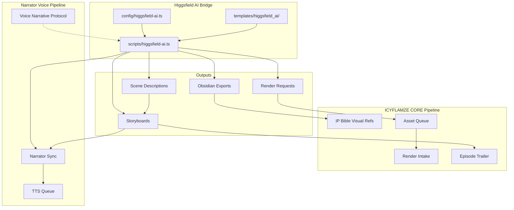

# Higgsfield AI Bridge

> **Phase 15A: AI Video Generation Adapter for ICYFLAMZE CORE Tool Stacks**

## Purpose

The Higgsfield AI Bridge integrates Open Higgsfield AI (AI video generation) into the Brilliantaire OS tool stack as a **manual-first visual output adapter**. It connects the ICYFLAMZE CORE creative pipeline to AI-driven video generation capabilities, complementing the existing audio/voice pipeline (Narrator, TTS, ASR) with a visual production channel.

## Architecture

## Safety Rules

| Flag | Value | Effect |
|---|---|---|
| `ALLOW_DIRECT_HIGGSFIELD_API` | `false` | No direct API calls to Higgsfield AI |
| `ALLOW_AUTONOMOUS_RENDER` | `false` | No automated render execution |
| `ALLOW_EXTERNAL_API_CALLS` | `false` | No network requests of any kind |
| `ALLOW_DIRECT_OBSIDIAN_WRITE` | `false` | Obsidian exports staged only |
| `REQUIRE_MANUAL_APPROVAL` | `true` | Human approval before render submission |
| `REQUIRE_RENDER_REVIEW` | `true` | Visual review required for all renders |

## CLI Commands

| Command | Description |
|---|---|
| `npm run higgsfield-ai -- "create-render <TYPE> <DESC>"` | Stage a render request |
| `npm run higgsfield-ai -- "create-scene <TITLE> <COMP>"` | Create a scene description |
| `npm run higgsfield-ai -- "create-storyboard <TITLE>"` | Compile scenes into a storyboard |
| `npm run higgsfield-ai -- "narrator-sync <FILE>"` | Generate narrator sync package |
| `npm run higgsfield-ai -- "obsidian-export"` | Stage Obsidian export summary |
| `npm run higgsfield-ai -- "status"` | Print bridge status report |
| `npm run higgsfield-ai-help` | Print CLI help menu |

## Supported Render Types

- `character-animation` - Character motion sequences
- `scene-transition` - Visual scene transitions
- `music-video-sequence` - Full music video segments
- `trailer-clip` - Trailer/teaser clips
- `lyric-visual` - Lyric visualization overlays
- `cover-art-motion` - Animated cover art
- `storyboard-preview` - Quick storyboard previews

## ICYFLAMZE CORE Integration

The bridge feeds into four ICYFLAMZE CORE pipeline points:

1. **Episode Trailer Render** - Visual clips for episode trailers
2. **IP Bible Visual Reference** - Reference imagery for the Street Scholar Futurism universe
3. **Asset Queue Submission** - Staged visual assets enter the production queue
4. **Render Intake Handoff** - Approved renders hand off to the assembly tracker

## Narrator Pipeline Integration

The bridge produces **narrator sync packages** that link:
- Storyboard scene timing to voice-over scripts
- TTS queue entries to visual segments
- Audio render status to video render status

This enables synchronized voice + video production across the ICYFLAMZE CORE pipeline.

## Output Directories

| Directory | Contents |
|---|---|
| `outputs/higgsfield_ai/render_requests/` | Staged render request documents |
| `outputs/higgsfield_ai/scene_descriptions/` | Scene composition documents |
| `outputs/higgsfield_ai/storyboards/` | Compiled storyboard sequences |
| `outputs/higgsfield_ai/approved_renders/` | Approved render packages |
| `outputs/higgsfield_ai/narrator_sync/` | Narrator sync timing packages |
| `outputs/higgsfield_ai/obsidian_exports/` | Obsidian export summaries |
| `outputs/higgsfield_ai/logs/` | Bridge event logs |

## Future API Boundary

When Higgsfield AI API access is enabled:
1. `ALLOW_DIRECT_HIGGSFIELD_API` will be set to `true`
2. A dedicated MCP adapter (similar to NotebookLM MCP) will be created
3. Render requests will be submitted through a staging + approval gate
4. Autonomous rendering will remain disabled by default
5. All API responses will be logged and reviewed before integration
