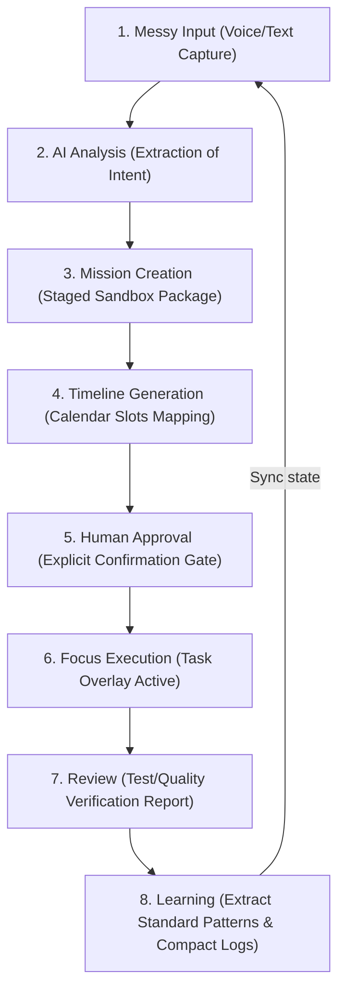

# 📋 Product Requirements Document (PRD): IcyOS MVP v0.1
`Version: 1.1.0` | `Status: Active` | `Scope: Product`

This document details the functional features, target behaviors, and MVP loop specs for **IcyOS**.

---

## 🎯 MVP Core Execution Loop
The MVP is strictly limited to the following lifecycle. Do not expand development bounds beyond this loop:

### Core Engine Responsibilities:
1. **Messy Input Capture**: VibeVoice and Live ASR Bridges ingest raw, unstructured voice phrases.
2. **Intent Analysis**: Extraction of priority weights and date limits.
3. **Mission Sandboxing**: Staging context packages under localized folders.
4. **Approval Gate**: Human validation commands (`voice-confirm`, `approve-write`) release execution block.
5. **Session Review**: Telemetry generation reporting linter and compiler metrics.
6. **Adaptive Learning**: Continuous updates to prompt libraries and lessons learned logs.

---

## 📋 Document Metadata
- **Purpose**: Outline MVP requirements and user flow loops.
- **Responsibilities**: Governs all product milestones.
- **Dependencies**: [Founder Intent](file:///Users/alexanderanthony/Knowledge%20Core/IcyOS/00%20Executive%20Office/Founder%20Intent.md)
- **Relationships**: Informs Technical Design and AI Specifications.
- **Version**: 1.1.0
- **Revision History**:
  - `2026-07-02`: Created initial v1.0.
  - `2026-07-02`: Upgraded to v1.1.0 for ICOS.
- **Future Expansion**: Add voice-synthesized command review tests.
- **Cross References**:
  - [Founder Intent](file:///Users/alexanderanthony/Knowledge%20Core/IcyOS/00%20Executive%20Office/Founder%20Intent.md)
  - [Product Philosophy](file:///Users/alexanderanthony/Knowledge%20Core/IcyOS/00%20Executive%20Office/Product%20Philosophy.md)
  - [Technical Design Document](file:///Users/alexanderanthony/Knowledge%20Core/IcyOS/02%20Engineering/Technical%20Design%20Document.md)

*I build before burning.*
