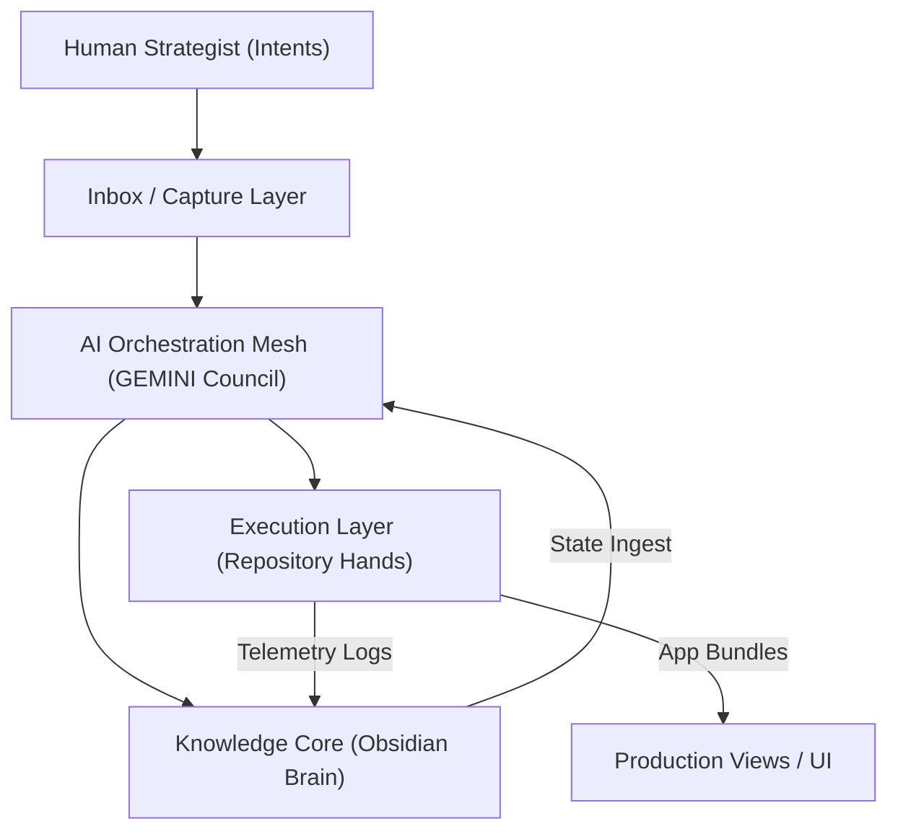

# 🏛️ Technical Design Document (TDD): System Blueprint
`Version: 1.1.0` | `Status: Active` | `Scope: Engineering`

This document details the architectural boundaries, system components, and multi-agent coordination frameworks of **IcyOS**.

---

## 🗺️ System Topology

---

## 🛠️ The IICOS Technical Stack
The system is built as a **web application / PWA first** to guarantee maximum portability and ease of design iteration, with native iOS integrations deferred to Phase 2.

- **Frontend**: Next.js App Router (v14+), React 18+, Tailwind CSS.
- **Backend API**: Node.js v20 executing compiled TypeScript, paired with BullMQ and Redis queues.
- **Database**: PostgreSQL (managed via Supabase).
- **Core AI Integration**: OpenAI API, Anthropic SDK (for agent code writes).
- **Interface**: PWA (Progressive Web App) first to ensure high-leverage mobile capability.
- **Native iOS**: Deferred (NOT Phase 1 unless required later for deep iOS system integrations).

---

## 📋 Document Metadata
- **Purpose**: Document system topologies and technology stack choices.
- **Responsibilities**: Enforces tech stack constraints.
- **Dependencies**: [Product Requirements Document](file:///Users/alexanderanthony/Knowledge%20Core/IcyOS/01%20Product/Product%20Requirements%20Document.md)
- **Version**: 1.1.0
- **Revision History**:
  - `2026-07-02`: Created initial design.
  - `2026-07-02`: Upgraded to v1.1.0 for ICOS.
- **Future Expansion**: Add specific container routing paths.
- **Cross References**:
  - [START HERE](file:///Users/alexanderanthony/Knowledge%20Core/IcyOS/99%20Command%20Center/START%20HERE.md)
  - [System Architecture](file:///Users/alexanderanthony/Knowledge%20Core/IcyOS/02%20Engineering/System%20Architecture.md)

*I build before burning.*
