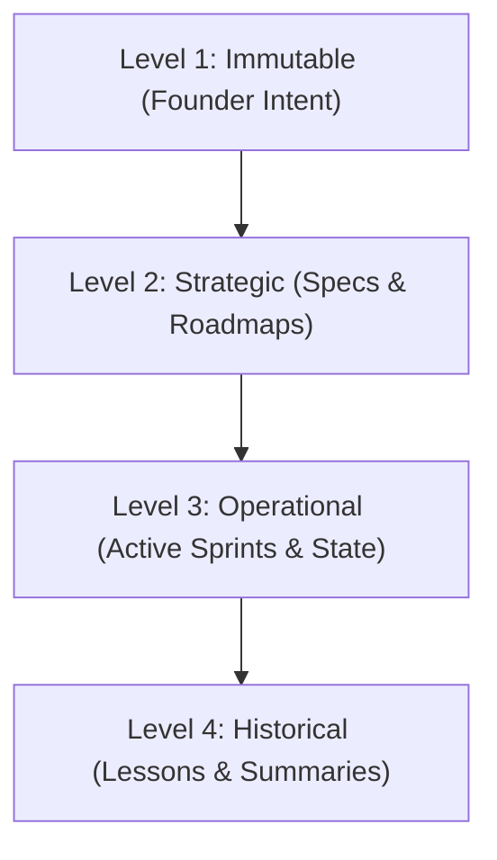

# 🌍 Global Context: ICOS Memory Hierarchies
`Version: 1.1.0` | `Status: Active` | `Scope: Memory`

This document details the active workspace mapping and the upgraded **four-level memory hierarchy** of **IcyOS**.

---

## 🏛️ The Four Memory Levels

### 🔒 Level 1: Immutable (Careful Review Required)
- **Files**: `Founder Intent.md`, `Vision.md`, `Mission.md`, `Company Principles.md`.
- **Update Frequency**: Extremely rare. Changes must be manually approved by the Founder and signify a major strategic redirection.

### 📐 Level 2: Strategic (Verification Required)
- **Files**: `Technical Design Document.md`, `Product Requirements Document.md`, `Product Roadmap.md`, `AI Intelligence Specification.md`.
- **Update Frequency**: Occasional. Updates occur when new features are mapped or database schemas are refactored.

### ⚡ Level 3: Operational (Frequent Automated Updates)
- **Files**: `Current Sprint.md`, `Current State.md`, `Open Decisions.md`.
- **Update Frequency**: Daily. Updated automatically at the end of every AI agent session or commit run to reflect active tickets.

### 📚 Level 4: Historical (Append-Only)
- **Files**: `Research Notes.md`, `Lessons Learned.md`, `Session Summaries.md`.
- **Update Frequency**: Constant. Agents append retrospective findings and logging notes after completing work.

---

## 📋 Document Metadata
- **Purpose**: Record memory tiers and project boundaries.
- **Version**: 1.1.0
- **Revision History**:
  - `2026-07-02`: Created initial v1.0 context.
  - `2026-07-02`: Upgraded to v1.1.0.
- **Cross References**:
  - [START HERE](file:///Users/alexanderanthony/Knowledge%20Core/IcyOS/99%20Command%20Center/START%20HERE.md)

*I build before burning.*
