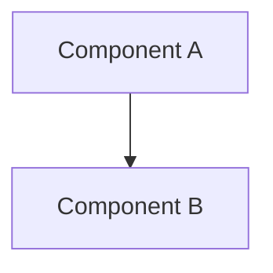

# 🏛️ Architecture Design: [Subsystem Title]
`Version: 1.0.0` | `Status: Active` | `Scope: Architecture`

## 🎯 Purpose
[Define the scope of the system component.]

## 🗺️ Topology Diagram

## 🛡️ Boundary Rules
- 

---

## 📋 Document Metadata
- **Version**: 1.0.0
- **Revision History**:
  - `{{date:YYYY-MM-DD}}`: Initial write.
- **Future Expansion**: 
- **Cross References**:
  - [START_HERE](file:///Users/alexanderanthony/Knowledge%20Core/IcyOS/START_HERE.md)

*I build before burning.*
