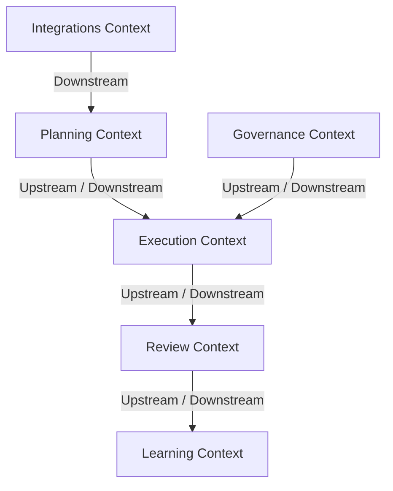

# 🗺️ Bounded Context Map
`Version: 1.0.0` | `Status: Active` | `Scope: Domain Model`

Specifies Upstream (U) and Downstream (D) relationships between contexts.

---

## 🗺️ Mermaid Context Map

---

## 📋 Document Metadata
- **Purpose**: Map Bounded Context relationships.
- **Version**: 1.0.0

*I build before burning.*
