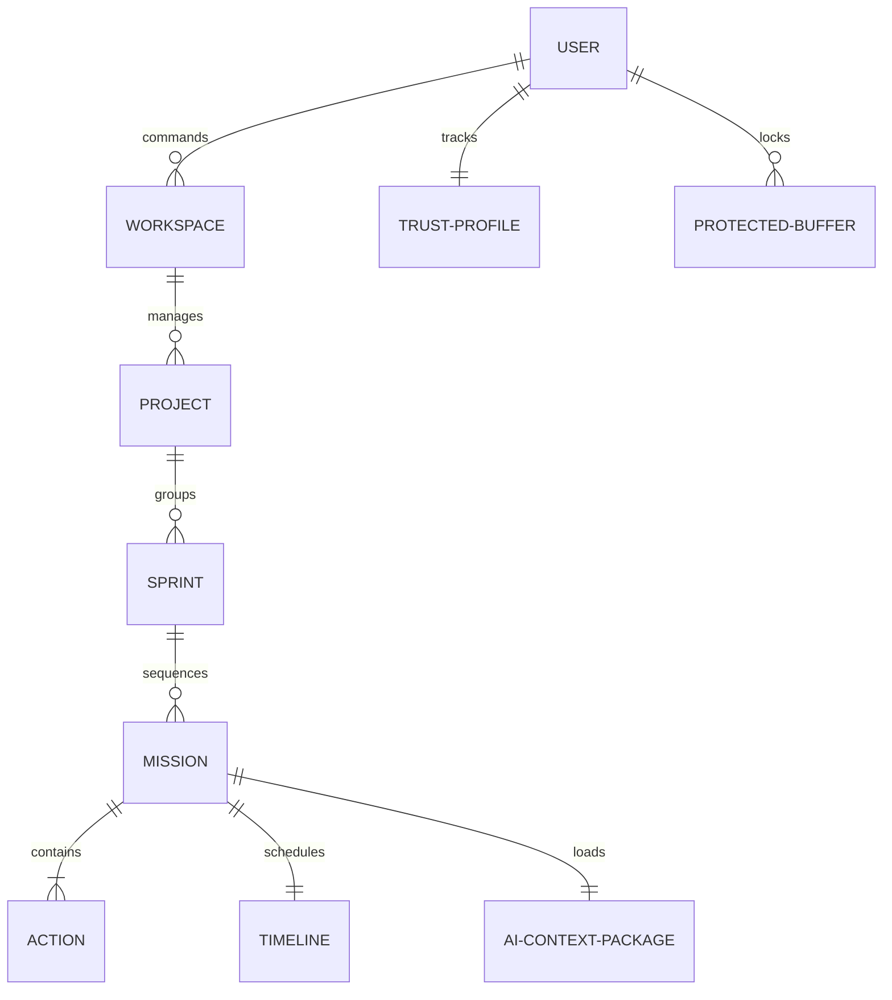

# 🗺️ Entity Relationship Map
`Version: 1.0.0` | `Status: Active` | `Scope: Domain Model`

Logical relationship map showing aggregate roots and entity relations.

---

## 🗺️ Entity Relationship Diagram

---

## 📋 Document Metadata
- **Purpose**: Record entity relationship maps.
- **Version**: 1.0.0

*I build before burning.*
