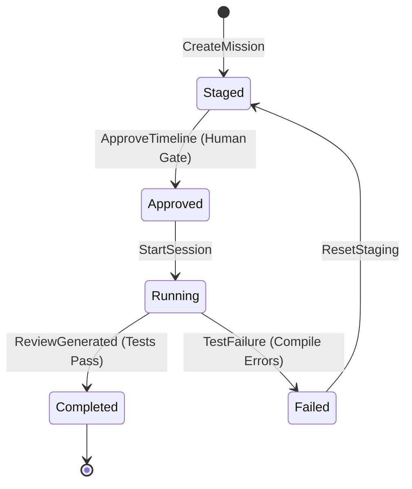

# 🔄 Lifecycle Definitions & State Machines
`Version: 1.0.0` | `Status: Active` | `Scope: Domain Model`

Maps state machine diagrams and transition triggers for core aggregates lifecycles.

---

## 🧭 Mission Lifecycle State Machine

---

## 📋 Document Metadata
- **Purpose**: Record state machine parameters.
- **Version**: 1.0.0

*I build before burning.*
