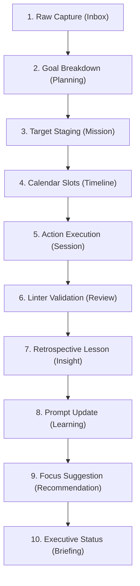

# 📡 Information Flow & Data Pipelines
`Version: 1.0.0` | `Status: Active` | `Scope: Information Architecture`

Maps the execution pipeline showing how raw data propagates and evolves.

---

## 🧭 Information Pipeline Flowchart

---

## 📋 Document Metadata
- **Purpose**: Record pipeline logic.
- **Version**: 1.0.0

*I build before burning.*
