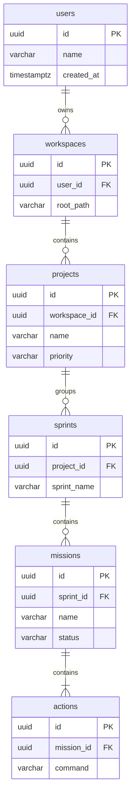

# 🗄️ CANONICAL DATABASE ARCHITECTURE v1.0
`Version: 1.0.0` | `Status: Approved` | `Scope: Database Architecture`

This document details the physical database mappings, table columns, constraints, and Row Level Security (RLS) policies for **IcyOS** on Supabase PostgreSQL.

---

## 🗺️ Mermaid ER Diagram: Core Productivity Model

---

## 🗂️ Database Tables Catalog

### 1. `users`
- **Purpose**: Record user accounts.
- **Source Entity**: `User`.
- **Columns**: `id: uuid PK`, `name: varchar REQUIRED`, `timezone: varchar`.
- **Audit Columns**: `created_at`, `updated_at`.
- **RLS Policy**: `auth.uid() = id` (Select/Update).

### 2. `workspaces`
- **Purpose**: Map repo root paths.
- **Source Entity**: `Workspace`.
- **Columns**: `id: uuid PK`, `user_id: uuid FK(users)`, `root_path: varchar REQUIRED`.
- **RLS Policy**: Workspace ownership checks.

### 3. `projects`
- **Purpose**: Mapped project list.
- **Source Entity**: `Project`.
- **Columns**: `id: uuid PK`, `workspace_id: uuid FK(workspaces)`, `name: varchar REQUIRED`, `priority: varchar REQUIRED`.
- **RLS Policy**: Filtered via workspace.

### 4. `sprints`
- **Purpose**: Delivery milestones.
- **Source Entity**: `Sprint`.
- **Columns**: `id: uuid PK`, `project_id: uuid FK(projects)`, `sprint_name: varchar REQUIRED`.

### 5. `missions`
- **Purpose**: Staging target directories package.
- **Source Entity**: `Mission`.
- **Columns**: `id: uuid PK`, `sprint_id: uuid FK(sprints)`, `name: varchar REQUIRED`, `status: varchar REQUIRED`.

### 6. `actions`
- **Purpose**: Logs commands.
- **Source Entity**: `Action`.
- **Columns**: `id: uuid PK`, `mission_id: uuid FK(missions)`, `command: varchar REQUIRED`.

### 7. `timelines`
- **Purpose**: Scheduled times calendar.
- **Source Entity**: `Timeline`.
- **Columns**: `id: uuid PK`, `user_id: uuid FK(users)`.

### 8. `timeline_blocks`
- **Purpose**: Mapped calendar blocks.
- **Source Entity**: None (Relational helper).
- **Columns**: `id: uuid PK`, `timeline_id: uuid FK(timelines)`, `mission_id: uuid FK(missions)`, `start_time: timestamptz REQUIRED`, `end_time: timestamptz REQUIRED`.

### 9. `blueprints`
- **Purpose**: Diagram storage.
- **Source Entity**: `Blueprint`.
- **Columns**: `id: uuid PK`, `diagram_syntax: text REQUIRED`.

### 10. `blueprint_steps`
- **Purpose**: Diagram nodes relation helper.
- **Columns**: `id: uuid PK`, `blueprint_id: uuid FK(blueprints)`.

### 11. `trust_profiles`
- **Purpose**: Metric scores tracking.
- **Source Entity**: `Trust Profile`.
- **Columns**: `id: uuid PK`, `user_id: uuid FK(users)`, `trust_score: numeric(3,2) REQUIRED`.
- **Constraints**: `CHECK (trust_score >= 0.0 AND trust_score <= 1.0)`.

### 12. `executive_briefings`
- **Purpose**: Sprint progress briefs.
- **Source Entity**: `Executive Briefing`.
- **Columns**: `id: uuid PK`, `content: text REQUIRED`.

### 13. `recommendations`
- **Purpose**: Backlog selections.
- **Source Entity**: `Recommendation`.
- **Columns**: `id: uuid PK`, `actionable_task_id: uuid REQUIRED`.

### 14. `reviews`
- **Purpose**: Tests checks validation.
- **Source Entity**: `Review`.
- **Columns**: `id: uuid PK`, `linter_errors_count: int REQUIRED`.

### 15. `insights`
- **Purpose**: Learning findings.
- **Source Entity**: `Insight`.
- **Columns**: `id: uuid PK`, `findings: text REQUIRED`.

### 16. `learning_records`
- **Purpose**: Prompt templates.
- **Source Entity**: `Learning Record`.
- **Columns**: `id: uuid PK`, `prompt_syntax: text REQUIRED`.

### 17. `protected_buffers`
- **Purpose**: Rest time schedules.
- **Source Entity**: `Protected Buffer`.
- **Columns**: `id: uuid PK`, `user_id: uuid FK(users)`, `start_hour: int REQUIRED`, `end_hour: int REQUIRED`.
- **Constraints**: `CHECK (start_hour >= 0 AND start_hour <= 23 AND end_hour >= 0 AND end_hour <= 23)`.

### 18. `trade_off_decisions`
- **Purpose**: Relational descope logs.
- **Source Entity**: `Trade-Off Decision`.
- **Columns**: `id: uuid PK`, `selected_option: varchar REQUIRED`.

### 19. `notifications`
- **Purpose**: Alerts.
- **Source Entity**: `Notification`.
- **Columns**: `id: uuid PK`, `message: text REQUIRED`.

### 20. `ai_decisions`
- **Purpose**: Logs plans.
- **Source Entity**: `AI Decision`.
- **Columns**: `id: uuid PK`, `plan_json: jsonb REQUIRED`.

### 21. `ai_context_packages`
- **Purpose**: Files path context packaging.
- **Source Entity**: `AI Context Package`.
- **Columns**: `id: uuid PK`, `file_paths: jsonb REQUIRED`.

### 22. `knowledge_assets`
- **Purpose**: Spec index tracking.
- **Source Entity**: `Knowledge Asset`.
- **Columns**: `id: uuid PK`, `path: varchar REQUIRED`.

### 23. `architecture_decisions`
- **Purpose**: ADR index tracking.
- **Source Entity**: `Architecture Decision`.
- **Columns**: `id: uuid PK`, `adr_id: varchar REQUIRED`.

### 24. `memory_entries`
- **Purpose**: Lessons history database.
- **Source Entity**: `Memory Entry`.
- **Columns**: `id: uuid PK`, `content: text REQUIRED`.

---

## 📋 Document Metadata
- **Purpose**: Canonical reference sheet for Supabase PostgreSQL tables schemas.
- **Version**: 1.0.0
- **Cross References**:
  - [START HERE](file:///Users/alexanderanthony/Knowledge%20Core/IcyOS/99%20Command%20Center/START%20HERE.md)

*I build before burning.*
