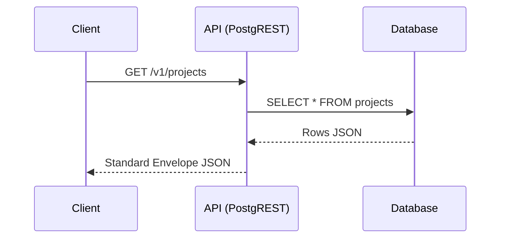
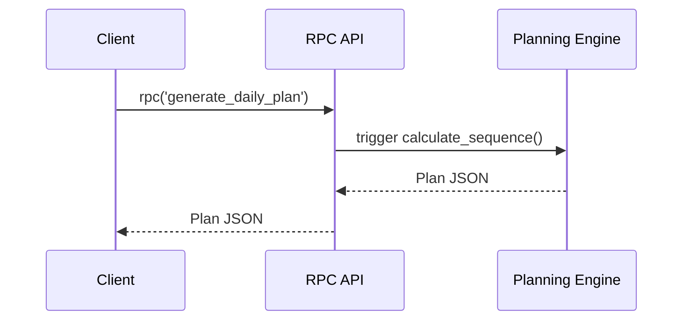
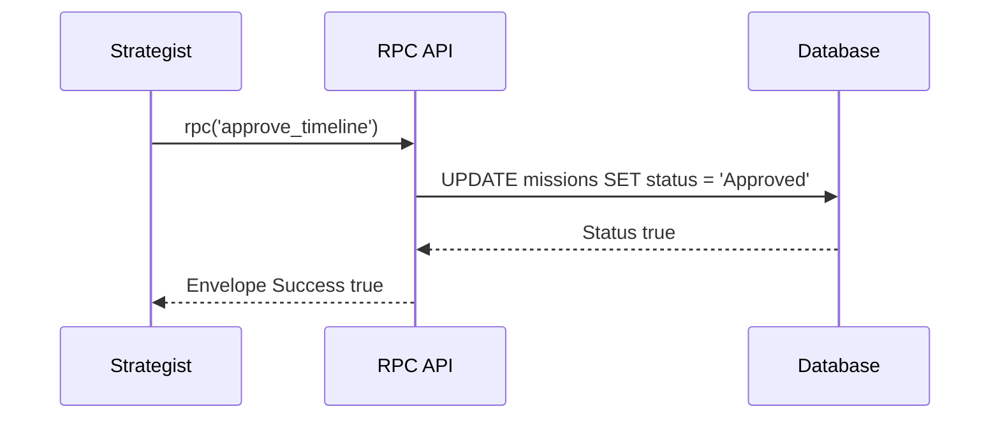

# 📐 CANONICAL API CONTRACTS v1.0
`Version: 1.0.0` | `Status: Approved` | `Scope: API Contracts`

This document details the standard response templates, error models, Supabase RPC signatures, and realtime event channels for **IcyOS**.

---

## 📨 Standard Response Envelope
All API endpoints must return payload wrappers in the following shape:

```json
{
  "success": true,
  "data": {},
  "error": null,
  "meta": {
    "request_id": "req-12345",
    "timestamp": "2026-07-02T09:00:00Z",
    "version": "v1"
  }
}
```

---

## 🚫 Standard Error Model
Error objects placed in the `error` property of the envelope:

```json
{
  "code": "validation_error",
  "message": "The provided fields are invalid.",
  "details": []
}
```

### Allowed Code Values
- `validation_error`
- `authorization_error`
- `not_found`
- `conflict`
- `rate_limited`
- `ai_confidence_low`
- `invariant_violation`
- `dependency_missing`
- `internal_error`

---

## 🔌 Supabase RPC Contracts

### 1. `generate_daily_plan`
- **Purpose**: Calculate task sequence mappings.
- **SQL Function Signature**: `rpc('generate_daily_plan', { user_id: uuid })`
- **Returns**: `jsonb`

### 2. `approve_timeline`
- **Purpose**: Update timeline slots approval status.
- **SQL Function Signature**: `rpc('approve_timeline', { timeline_id: uuid, user_id: uuid })`
- **Returns**: `boolean`

---

## 📡 Realtime Events channels
Exposes broadcast events on `supabase_realtime`:
- `mission.started`: `{ "mission_id": "uuid", "timestamp": "ISO-8601" }`
- `mission.completed`: `{ "mission_id": "uuid", "review_id": "uuid" }`
- `timeline.regenerated`: `{ "timeline_id": "uuid" }`

---

## 🗺️ Mermaid Flow Diagrams

### 1. Client to API to Supabase flow


### 2. AI Planning Request Flow


### 3. Timeline Approval Flow


---

## 📋 Document Metadata
- **Purpose**: Canonical reference sheet for API contracts.
- **Version**: 1.0.0
- **Cross References**:
  - [START HERE](file:///Users/alexanderanthony/Knowledge%20Core/IcyOS/99%20Command%20Center/START%20HERE.md)

*I build before burning.*
