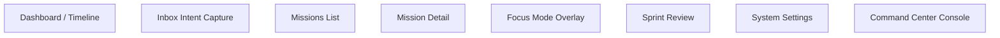
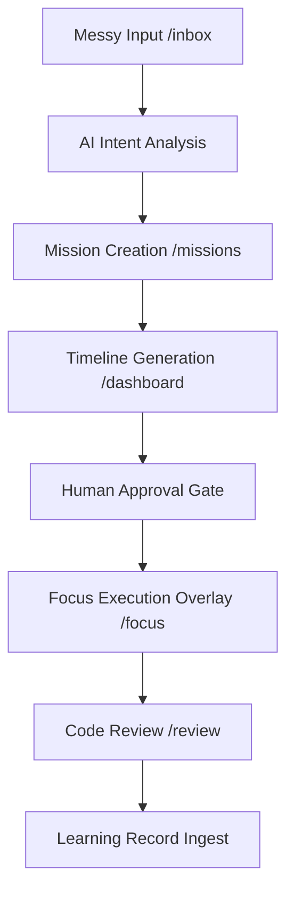

# 🌐 CANONICAL APPLICATION ARCHITECTURE v1.0
`Version: 1.0.0` | `Status: Approved` | `Scope: Application Architecture`

This document defines the Next.js App Router routing layouts, primary screen modules, state lifecycles, and user interactions flow for **IcyOS**.

---

## 🧭 MVP Route Map

---

## 📺 Primary Screen Modules

### 1. Executive Briefing
- **Route**: `/dashboard` (Top component banner).
- **Purpose**: Expose high-level sprint summaries and active indicators.
- **Data requirements**: `executive_briefings` row matching current active sprint.
- **State requirements**: Read-only, collapsible states.

### 2. Inbox
- **Route**: `/inbox`
- **Purpose**: capture unstructured intent texts.
- **Components**: `InboxCaptureBox`, `AIPlanPreview`.
- **State requirements**: Input staging string, processing status.

### 3. Daily Timeline
- **Route**: `/dashboard` (Main container).
- **Purpose**: Render hourly task slot coordinates.
- **Components**: `TimelineView`, `TimelineBlock`.

### 4. Mission Detail
- **Route**: `/missions/:id`
- **Purpose**: Stage and run mission check tasks.
- **Components**: `MissionDetailPanel`, `ActionList`.

### 5. Focus Overlay
- **Route**: `/focus`
- **Purpose**: Full-screen modal blocking distraction during tasks.
- **Components**: `FocusOverlay`, `SessionTimer`.

### 6. Review
- **Route**: `/review`
- **Purpose**: Display compile test checklist validation outputs.

### 7. Settings
- **Route**: `/settings`
- **Purpose**: Toggle muting flags and trust profiles thresholds.

### 8. Command Center
- **Route**: `/console`
- **Purpose**: Trigger system scripts runs.

---

## 📡 MVP User Flow (Intelligent Loop)

---

## 📋 Document Metadata
- **Purpose**: Canonical reference sheet for application architecture.
- **Version**: 1.0.0
- **Cross References**:
  - [START HERE](file:///Users/alexanderanthony/Knowledge%20Core/IcyOS/99%20Command%20Center/START%20HERE.md)

*I build before burning.*
