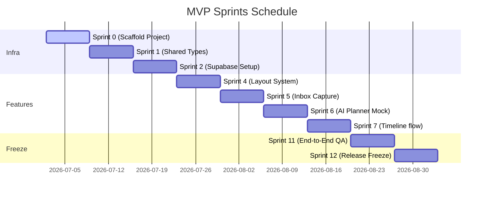

# 🏁 CANONICAL MVP IMPLEMENTATION PLAN v1.0
`Version: 1.0.0` | `Status: Approved` | `Scope: MVP Implementation Plan`

This document details the concrete sprint breakdown, testing gates, performance budgets, and deployment milestones for the **IcyOS** MVP loop.

---

## 🏃‍♂️ Sprint Delivery Sequence

---

## 🗂Sprints Objectives Summary

- **Sprint 0**: Repo and project scaffold initialization (`package.json`, TypeScript, directories).
- **Sprint 1**: Shared compile-time types configurations (`@icyos/shared` package).
- **Sprint 2**: Supabase database setup and local SQL migrations validation tests.
- **Sprint 3**: API client controllers mappings and integration services files.
- **Sprint 4**: AppShell layout setup, sidebars navigation templates.
- **Sprint 5**: Inbox intent raw capturing text inputs.
- **Sprint 6**: AI planning mock scheduler (simulating timeline results).
- **Sprint 7**: Daily timeline grid rendering and strategist human Approval Gate trigger logic.
- **Sprint 8**: Focus overlay execution panels and session duration timers.
- **Sprint 9**: Review validation checks lists compile logs, learning retrospectives.
- **Sprint 10**: Executive status briefings dashboard views.
- **Sprint 11**: End-to-end Playwright tests suites runs, security validations.
- **Sprint 12**: Code freeze, tag coordinate creation, deployment releases candidates.

---

## 🔒 MVP Scope Lock Rules
- **No Native Work**: Mobile web PWA layout first.
- **No Third Party Payment Mappings**: N/A.
- **No Multi-User Mappings**: Enforce single-user local configurations.
- **No Automations without Gates**: AI agents cannot commit changes without strategist validation approvals.

---

## 🚦 Release Testing Gates
- **Gate 1**: TypeScript type verification checks (`npm run typecheck`).
- **Gate 2**: Linter syntax errors audits (`npm run lint`).
- **Gate 3**: Unit tests coverage thresholds (requires > 80% coverage).
- **Gate 4**: Local Supabase RLS policies validations checks.

---

## 📊 Performance Budget
- **Initial dashboard load target**: < 1.5 seconds.
- **Timeline render target**: < 100 milliseconds.
- **API response target**: < 200 milliseconds.

---

## 📋 Document Metadata
- **Purpose**: Canonical reference sheet for MVP delivery.
- **Version**: 1.0.0
- **Cross References**:
  - [START HERE](file:///Users/alexanderanthony/Knowledge%20Core/IcyOS/99%20Command%20Center/START%20HERE.md)

*I build before burning.*
