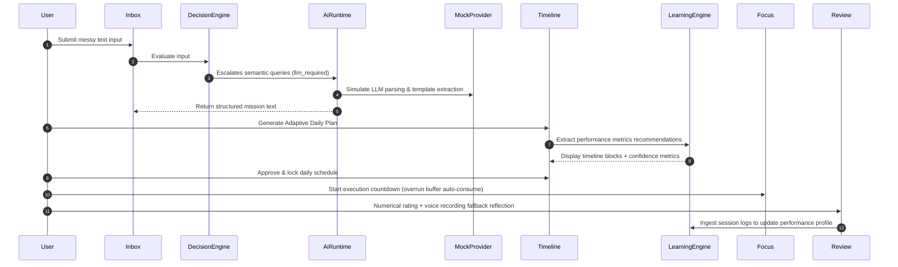

# 🚀 Release 0.1 Plan: IcyOS Beta Integration
`Phase: Product Validation` | `Version: 0.1.0` | `Theme: King on His Own Board`

This document details the rollout, testing schedule, and target integration milestones for the **IcyOS Release 0.1** release.

---

## 🎯 Release Objectives
1. **End-to-End Baseline**: Stitch the 15 sprints of Phase 1 into a singular, responsive flow.
2. **AI-Deterministic Orchestration**: Validate that the Decision Engine coordinates with the AI Runtime to process inbox inputs cleanly.
3. **Internal Team Trial**: Deploy the system to the agent council for daily workflow logging and performance indexing.

---

## 📅 Timeline & Milestones

| Milestone | Target Date | Scope | Owners |
|---|---|---|---|
| **M1: Boundary Lock** | 2026-07-03 | Refactor service constructors, lock packages interfaces. | SIDE / OS Architect |
| **M2: Workflow Stitching** | 2026-07-03 | Link Decision Engine to AI Runtime within PlanningService. | SID |
| **M3: Validation Run** | 2026-07-03 | Run workspace-wide typecheck, vitest, and packaging build. | Build Operator |
| **M4: Beta Freeze** | 2026-07-04 | Finalize release notes and deploy local SQLite/mock profiles. | OS Architect |

---

## 🛤️ End-to-End Journey Map
The user journey flows through the following 8 integrated phases:

---

## 👥 Target Beta Audience
- **Primary**: Icyflamze core team members testing strategic automation pipelines.
- **Secondary**: Multi-agent council simulators generating baseline telemetry.

*I build before burning.*
