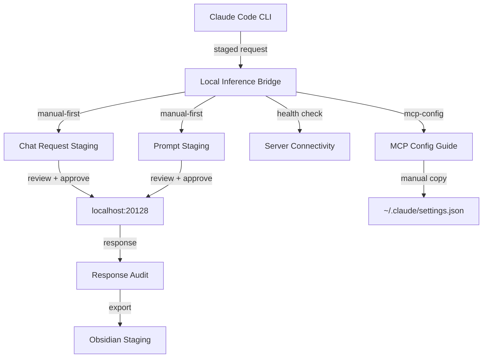

# Local Inference Server Bridge

> OpenAI-compatible local LLM inference endpoint integrated into the Brilliantaire OS tool stack and Claude Code.

## Overview

| Parameter | Value |
|---|---|
| **Server** | `http://localhost:20128/v1/chat/completions` |
| **Model** | `auto` |
| **Protocol** | OpenAI-compatible |
| **Credentials** | None (zero-credential) |
| **Bridge Mode** | manual-first |
| **Integration Target** | Claude Code |

## Architecture



## CLI Commands

| Command | Description |
|---|---|
| `npm run local-inference -- "status"` | Print bridge configuration and safety flags |
| `npm run local-inference -- "health-check"` | Verify server connectivity |
| `npm run local-inference -- "chat <MESSAGE>"` | Stage a chat completion request |
| `npm run local-inference -- "stage-prompt <SYS> \| <USR>"` | Stage structured prompt |
| `npm run local-inference -- "mcp-config"` | Generate MCP installation guide |
| `npm run local-inference -- "obsidian-export"` | Stage Obsidian export summary |

## Safety Configuration

| Flag | Default | Description |
|---|---|---|
| `ALLOW_LIVE_INFERENCE_CALLS` | `false` | Enable live HTTP calls to the inference server |
| `ALLOW_AUTONOMOUS_INFERENCE` | `false` | Allow unattended inference execution |
| `ALLOW_EXTERNAL_MODEL_DOWNLOAD` | `false` | Allow downloading external model files |
| `REQUIRE_MANUAL_PROMPT_REVIEW` | `true` | Require human review before execution |
| `REQUIRE_RESPONSE_AUDIT` | `true` | Require human audit of responses |

## Output Directories

| Directory | Purpose |
|---|---|
| `outputs/local_inference/chat_requests/` | Staged chat completion requests |
| `outputs/local_inference/responses/` | Captured server responses |
| `outputs/local_inference/prompt_staging/` | Structured prompt staging area |
| `outputs/local_inference/obsidian_exports/` | Obsidian vault export summaries |
| `outputs/local_inference/logs/` | Bridge event logs |

## MCP Installation (Local Machine)

To install this inference server in Claude Code on your local machine:

1. **Verify the server is running:**
   ```bash
   curl http://localhost:20128/v1/chat/completions \
     -H "Content-Type: application/json" \
     -d '{"model":"auto","messages":[{"role":"user","content":"Hello!"}]}'
   ```

2. **Add to Claude Code MCP config** (`~/.claude/settings.json` or `.mcp.json`):
   ```json
   {
     "mcpServers": {
       "local-inference": {
         "command": "node",
         "args": ["dist/scripts/local-inference.js"],
         "env": {
           "LOCAL_INFERENCE_ENABLED": "true",
           "LOCAL_INFERENCE_URL": "http://localhost:20128"
         }
       }
     }
   }
   ```

3. **Restart Claude Code** to detect the new MCP server.

## Approved Use Cases

- Research augmentation
- Draft composition
- Code review assist
- Knowledge queries
- Narrator draft assist
- Creative brainstorm

## Integration Points

- **MCP Server Tool** — Registered as an MCP tool in Claude Code
- **Prompt Engineer Assist** — Available to the Prompt Engineer agent for draft generation
- **Narrator Draft Feed** — Supplies draft content to the narrator pipeline
- **Knowledge Harvest Augmentation** — Augments knowledge harvest with local inference
