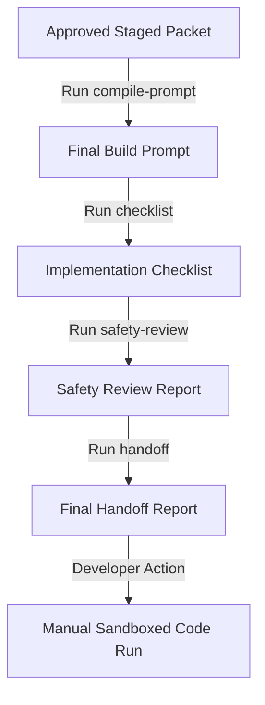

# Manual Implementation Packet Compiler

## Purpose
The Manual Implementation Packet Compiler converts the approved implementation packet and manual execution brief from Phase 13F into a single, cohesive, review-ready final build prompt. This represents the last documentation boundary of Phase 13 before physical implementation work begins, ensuring all safety rules, file structures, and verification checklists are locked down.

## Why Manual Packet Compilation Follows Approval Routing
Autonomous agents must not write code or alter core software configurations without a deterministic, validated specification. The stage gate (Phase 13E) stages a proposal; the approval router (Phase 13F) validates the recommended status; the compiler (Phase 13G) translates these components into a formal, human-reviewable instruction prompt. This tiered structure ensures safety checks are performed at every layer.

## Strict No-Execution Rule
Consistent with the system's security architecture:
- `PACKET_COMPILER_ONLY = true`
- `ALLOW_SCRIPT_EXECUTION = false`
- `ALLOW_RAW_COMMAND_EXECUTION = false`
- `ALLOW_AUTO_BUILD = false`
- `ALLOW_OBSIDIAN_WRITE = false`
- `ALLOW_NEXT_ACTIONS_AUTO_WRITE = false`

The compiler only reads configuration documents and outputs text templates. No scripts, shells, database writes, or Obsidian modifications are triggered.

## Operations Flow

### 1. Final Build Prompt Flow
Combines context from the approved implementation packet, extracting file changes, objectives, commit messages, and verification commands into a single standard Markdown template under:
`outputs/knowledge_harvest/manual_implementation/prompts/final_manual_build_prompt_YYYY-MM-DD.md`

### 2. Checklist Flow
Compiles an implementation compliance check list, verifying presence of maps, prompts, and config flags, saving results under:
`outputs/knowledge_harvest/manual_implementation/checklists/manual_implementation_checklist_YYYY-MM-DD.md`

### 3. Safety Review Flow
Audits potential risks and boundaries, logging safety status and blocked actions under:
`outputs/knowledge_harvest/manual_implementation/reports/manual_implementation_safety_review_YYYY-MM-DD.md`

### 4. Handoff Flow
Summarizes outputs, paths, and next actions to present a finalized task package to the operator under:
`outputs/knowledge_harvest/manual_implementation/reports/manual_implementation_handoff_YYYY-MM-DD.md`

## Future Execution Boundary
After manual handoff verification, Phase 13 concludes. The resulting prompts and checklists are executed by human developers or sandboxed task workers during Phase 13H.
