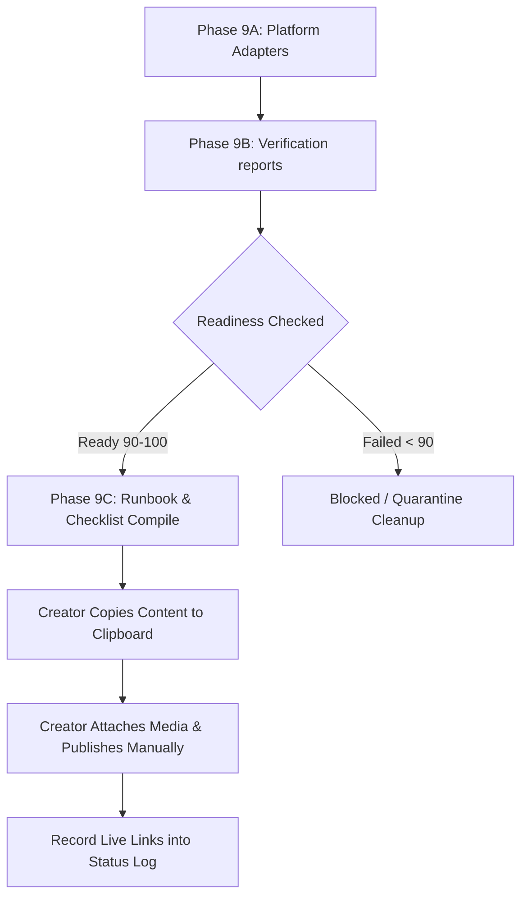

# 📋 Manual Release Checklist (Phase 9C)

This document specifies the design, runbook schema, manual safety constraints, and publication workflow for the **Manual Release Checklist** layer in **Brilliantaire OS**.

---

## 1. Purpose

The **Manual Release Checklist** layer translates verified platform packages and validation reports into a structured, copy-paste execution plan for the creator. It aggregates files, assets, CTA check-toggles, and campaign metadata into manual checksheets and runbooks, serving as the final gate before live publication.

---

## 2. The Manual-Only Rule & Boundary

To safeguard creator sovereignty and prevent execution collisions:
1. **Zero Auto-Posting:** The system has NO direct connection to third-party social media APIs. It does not publish posts, upload video files, edit profile configurations, or trigger background network posting workers.
2. **Zero File Uploads:** Uploading of media files to hosting platforms is purely manual.
3. **No Scraping/Feedback Loops:** The OS does not scrape social networks to audit posts. Live links must be manually entered back into checkpoints.
4. **Clipboard Handoff Interface:** The system prepares clean copy-paste text fields and asset notes, allowing copy-pasting directly from the workspace to the platform uploaders.

---

## 3. Supported Platforms
* **YouTube:** Teasers and official audio videos with description link CTAs.
* **TikTok:** Vertical video captions, sound notes, and overlay text.
* **Instagram:** Reels, carousel descriptions, and Story sticker copy.
* **Facebook:** Public page posts, community group shares, and reply starters.
* **WhatsApp:** Broadcast announcements, community threads, and short reminders.
* **Obsidian:** Local campaign notes update and next actions checklist linking.

---

## 4. Manual Release Process Flow

### Runbook Flow:
1. Creator reads `sporty_manual_release_runbook_YYYY-MM-DD.md`.
2. Verifies pre-post conditions (logged in account check, audio files match).
3. Executes the chronological release order (e.g. YouTube Teaser -> TikTok -> Instagram Reels -> Facebook -> WhatsApp announcements).
4. Copies text directly from the copy-paste sheets.
5. Saves the published live URL to the status report file.

---

## 5. Metrics Tracking Integration

The checklists and runbooks prepare the OS for future metrics aggregation (Phase 10). By tracking the exact package filenames, verification scores, and recorded live URLs, the system can later query platform engagement statistics (views, impressions, interactions) to calculate campaign ROI offline.
