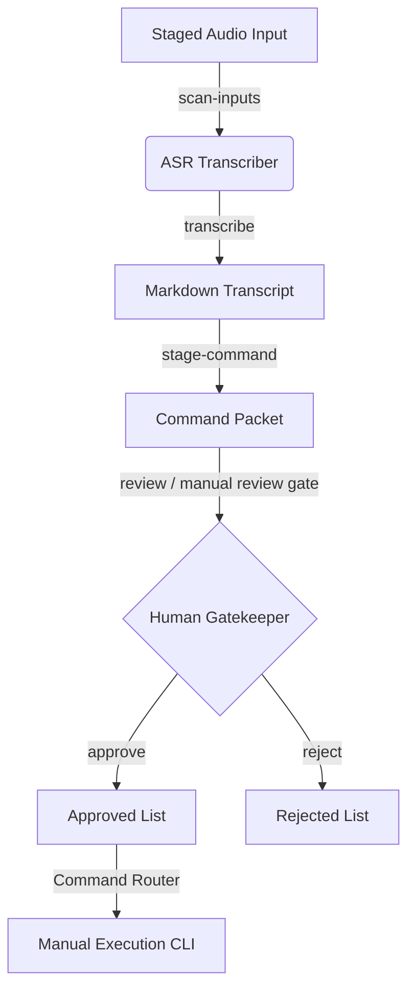

# 🎙️ Sentinel OS: Local ASR Command Listener (Phase N5D)

This document describes the design, flow, safety controls, and execution logic of the **Local ASR Command Listener** (Speech-to-Text).

---

## 1. Architectural Blueprint & Data Flow

The Local ASR Command Listener acts as an offline transcription interface that converts processed audio commands into structured VNP (Voice Narrative Protocol) command packets. 

### Flow Sequence:
1. **Audio Intake:** Voice commands or briefings are recorded locally and placed inside the controlled intake directory:
   `outputs/narrator/asr/input_audio/`
2. **Offline Transcription:** Whisper processes the audio file strictly offline, producing a metadata-backed transcript:
   `outputs/narrator/asr/transcripts/asr_transcript_<id>.md`
3. **Command Translation:** The transcript is parsed and translated into a pre-mapped CLI command packet:
   `outputs/narrator/asr/staged_commands/asr_command_packet_<id>.md`
4. **Approval Gate:** The staged command packet is reviewed. If approved, it is moved to:
   `outputs/narrator/asr/approved/asr_command_packet_<id>.md`
5. **No Auto-Execution:** The script guarantees that no command is executed automatically. It only registers it under the approved queue.

---

## 2. Safety Boundaries & Security Enforcements

To protect the system core, the ASR listener implements strict sandboxing:
- **Cloud Hard-Block:** External cloud transcription APIs are completely disabled. All translation occurs locally on device.
- **Audio Privacy:** Audio files are stored locally and are never uploaded or streamed to external servers.
- **No Live Mic by Default:** Continuous microphone polling or background triggers are disabled. Audio processing is manual-first.
- **Command Router Enforced:** Mapped commands must follow exact-name command routing rules and are whitelisted. Fuzzy or malicious CLI injections are rejected.

---

## 3. Supported CLI Command Gate

All ASR operations are registered and executed under the exact-name command router:
- `npm run narrator-asr-listener -- "status"`: Verify backend availability and staged queues.
- `npm run narrator-asr-listener -- "scan-inputs"`: Scan the intake audio directory.
- `npm run narrator-asr-listener -- "transcribe <PATH>"`: Synthesize audio to text.
- `npm run narrator-asr-listener -- "stage-command <ID>"`: Stage command packet.
- `npm run narrator-asr-listener -- "review <ID>"`: Display the staged command details.
- `npm run narrator-asr-listener -- "reject <ID>"`: Reject a command packet.
- `npm run narrator-asr-listener -- "approve <ID>"`: Register command packet as approved (no execution).
- `npm run narrator-asr-listener -- "queue-status"`: Display status logs of all queues.

---
*Authorized by Architect-Core under the One System protocol.*
