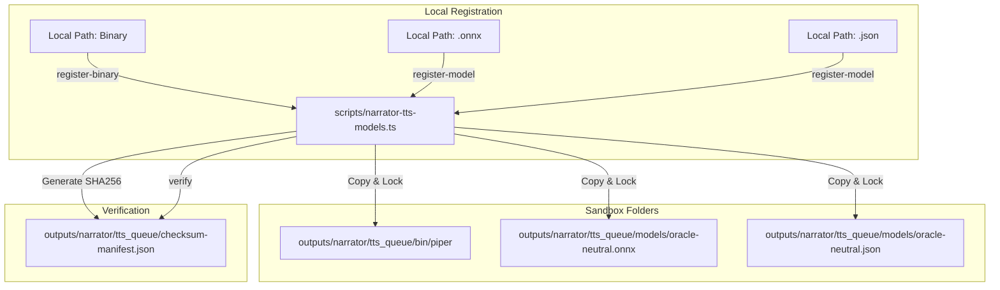

# 🎙️ Phase N5C: Local TTS Model Autoinstaller & Audio Cache Manager

Phase N5C establishes a local asset management layer to register, verify, and clean up offline speech synthesis engines (Piper) and their corresponding voice models.

---

## 🎯 Architecture Diagram

---

## 🛡️ Core Rules & Safety Boundaries

1. **Offline-First & Local-Only:** No network connections are permitted. The autoinstaller logic never initiates socket downloads or remote fetching. All files must be staged locally on the machine by the operator.
2. **Registration Checks:** Allowed binary names are strictly checked against a whitelist (`piper`, `piper-tts`). Voice models must end with `.onnx` and configs with `.json`.
3. **No Execution During Registration:** Files are verified strictly via SHA256 checksum computation and file signature validations. Newly copied binaries are never executed during registration.
4. **Cache Boundaries:** Cache clean actions only affect compiled audio files located inside the `rendered_audio/` directory. They never modify, delete, or touch registered models, configs, binaries, manifests, or staged request files.
5. **Manifest Lock:** The JSON checksum manifest maps exact SHA256 hashes to registered file paths. Any changes or mismatches detected during `verify` block renderer execution.

---

## ⚙️ Available Commands

All commands are controlled via the Command Router and require exact name matching:

### `status`
Displays binary, model, config, manifest, and cache status analytics.

### `scan`
Scans controlled folders for registered binaries, models, configs, and unknown or unsafe extensions.

### `verify`
Computes and compares SHA256 checksums of registered assets against the manifest to verify integrity.

### `register-binary <LOCAL_PATH>`
Registers and copies a local Piper executable, generates a SHA256 hash, and logs it in the manifest.

### `register-model <LOCAL_MODEL_PATH> <LOCAL_CONFIG_PATH>`
Registers a local `.onnx` voice model and `.json` voice configuration under the `oracle-neutral` profile.

### `cache-status`
Displays cache counts, total file sizes, and date ranges of compiled audio assets.

### `cache-clean-dry-run`
Simulates cache cleaning, reporting files targeted for deletion.

### `cache-clean-approved`
Deletes compiled audio files, freeing up cache disk space while keeping logs of the operation.
