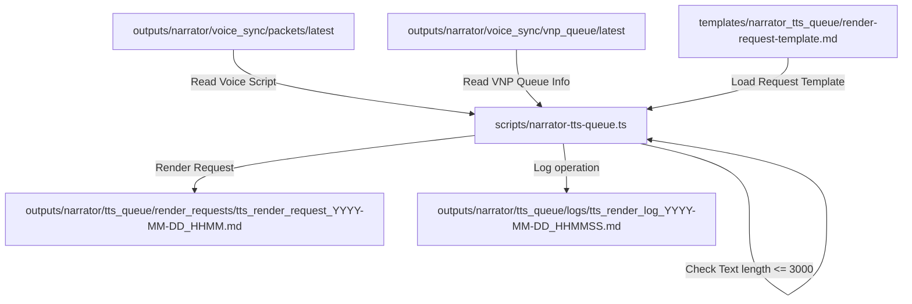
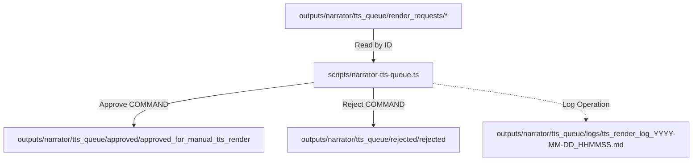

# 🎙️ Phase N5A: Local TTS Render Queue

The **Local TTS Render Queue** is a staging mechanism designed to queue, review, and manually approve voice narration script segments for offline Text-to-Speech (TTS) rendering. It establishes a secure boundary preventing unintended external network connections and auto-audio playback triggers.

---

## 🎯 Purpose
Provide a secure offline gateway for system voice outputs. The queue compiles text payloads from compiled voice scripts into render request files, which developers must approve before any speech synthesis or audio operations occur.

---

## 🛡️ Safety & Execution Rules
1. **Local-Only Render Queue:** All operations are performed on static Markdown files within `outputs/narrator/tts_queue/`.
2. **No External TTS API Calls:** Direct communication with external speech generation APIs (e.g. OpenAI TTS, ElevenLabs, Google Cloud TTS) is strictly disabled (`ALLOW_EXTERNAL_TTS_API = false`).
3. **No Auto-Playback:** St staged request packages must not auto-trigger audio playback pipelines (`ALLOW_AUDIO_PLAYBACK = false`). No speaker or microphone devices are opened by the queue controller.
4. **No Subprocess Command Execution:** Execution of command strings inside request files is prohibited.
5. **Exact-Name Routing Gate:** Main operations (`approve`, `reject`, `request`) require exact-name command invocation and block command alias execution to prevent accidental overrides.

---

## 🌊 Staging Queue Flows

### Render request compilation

### Manual approval & rejection Flow

---

## 🔮 Future Integration Boundaries

### 📡 Future Local TTS Adapter Boundary
In the next phase, a secure local offline synthesis engine (e.g. Python Kokoro or Piper integration) will scan the `tts_queue/approved/` folder. The local adapter will:
- Read the text-to-render blocks.
- Generate local `.mp3` or `.wav` outputs inside `tts_queue/rendered_audio/`.
- Maintain output isolation from system modification shells.

### 🔌 Future WebSocket Audio Feed Boundary
Real-time dashboard playback notifications will stream audio state events over a local WebSocket pipe. The socket server will:
- Stream only output notifications and metadata cards.
- Remain completely isolated from command routing.
- Execute in a separate process thread.
