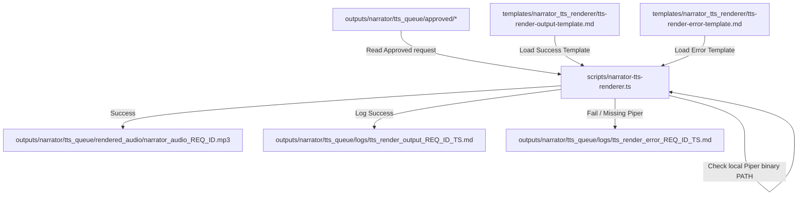

# 🎙️ Phase N5B: Local TTS Audio Renderer

The **Local TTS Audio Renderer** converts approved text-to-speech rendering requests into offline audio files using a local speech synthesis engine backend. It operates strictly locally, preventing automatic playback and isolating subprocess calls.

---

## 🎯 Purpose
Establish a secure, offline audio generation channel. The script processes text files staged in the `approved/` folder using local synthesis models (e.g. Piper), outputting final audio files without making external API requests.

---

## 🛡️ Safety & Execution Rules
1. **Approved-Request-Only Rendering:** Synthesis is strictly restricted to request files located under `outputs/narrator/tts_queue/approved/`. Staged files inside the `render_requests/` (pending) or `rejected/` folders are rejected.
2. **Local-Only Behavior:** All processing is executed locally on-device. No network connections are initiated (`ALLOW_EXTERNAL_TTS_API = false`).
3. **No Auto-Playback:** Compiled audio waves are stored silently inside `rendered_audio/` and must never be auto-played.
4. **Exact-Name Routing Gate:** Main operations (`status`, `dry-run`, `render`, `render-all-approved`) require exact command name matching via the Command Router.
5. **Payload Command Sanitization:** Payloads are treated strictly as text blocks to prevent command injections.

---

## 🌊 Staging Queue & Rendering Flow

---

## 🔮 Future Integration Boundaries

### 📡 Future Local TTS Adapter Integration
Subsequent phases will introduce automatic configuration pipelines for local voices and speed optimizations. The synthesis loop will:
- Read approved requests sequentially.
- Cache rendered models for reduced latency.
- Log complete metrics.

### 🔌 Future WebSocket Audio Feed Boundary
Real-time dashboard playback notifications will stream audio state events over a local WebSocket pipe. The socket server will:
- Stream only output notifications and metadata cards.
- Remain completely isolated from command routing.
- Execute in a separate process thread.
