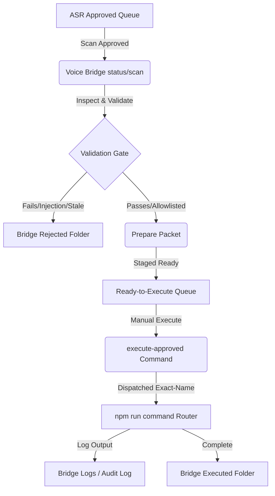

# 🎛️ Phase N5E: Voice Command Approval Bridge

The **Voice Command Approval Bridge** acts as an offline manual checkpoint that processes approved ASR command packets, validates them against rigorous security rules, stages them for execution, and triggers them via the exact-name command router. 

---

## 1. System Architecture

The Bridge bridges the gap between speech-to-text transcript command outputs and final OS script execution without allowing any unsupervised or automated execution.



---

## 2. Directories & Lifecycle

All operations run entirely locally using sandboxed files directories under `outputs/narrator/`:

- **Approved Intake Directory:** `outputs/narrator/asr/approved/`
- **Ready Queue Directory:** `outputs/narrator/voice_bridge/ready/`
- **Executed Queue Directory:** `outputs/narrator/voice_bridge/executed/`
- **Rejected Queue Directory:** `outputs/narrator/voice_bridge/rejected/`
- **Bridge Log Directory:** `outputs/narrator/voice_bridge/logs/`

---

## 3. Strict Safety Gates

To prevent command injection, directory traversal, and unauthorized script operations, the following controls are strictly enforced:

### A. No Auto-Execution Policy
All voice packets must pass through distinct, separate steps (`validate`, `prepare`, and `execute-approved`) triggered manually by an operator. The system *never* runs a voice command immediately upon transcription.

### B. Validation Checklist
- **Allowlist Match:** Mapped command must exactly match a entry in `ALLOWED_COMMAND_ROUTER_ENTRIES`. Any command not allowlisted is blocked immediately.
- **Maximum Length:** Mapped command strings must be under `200` characters.
- **No Shell Chaining or Operators:** Patterns like `;`, `&&`, `||`, `|`, `>`, `<`, backticks, and `$()` are banned.
- **Forbidden Commands:** Binary tags such as `sudo`, `rm`, `chmod`, `eval`, `curl`, and `wget` are explicitly filtered.
- **Timestamp Freshness:** Packets older than `24 hours` (freshness lifespan limit) are automatically rejected.
- **Confidence Gate:** Transcripts must have a confidence score of `>= 0.7`.

### C. Execution Path
Execution is dispatched only using the exact-name Command Router:
`npm run command -- "<EXACT_REGISTERED_COMMAND>"`

Raw shell parameters and transcript text are never interpreted as shell inputs directly.

---

## 4. Operational Runbook

### Step 1: Scan for Incoming Approved Transcripts
```bash
npm run narrator-voice-bridge -- "scan-approved"
```

### Step 2: Inspect a Staged Transcript ID
```bash
npm run narrator-voice-bridge -- "inspect <PACKET_ID>"
```

### Step 3: Run Validation & Prepare
```bash
npm run narrator-voice-bridge -- "prepare <PACKET_ID>"
```

### Step 4: Dispatch Execution
```bash
npm run narrator-voice-bridge -- "execute-approved <PACKET_ID>"
```

### Step 5: Review Auditing History
```bash
npm run narrator-voice-bridge -- "audit-log"
```
