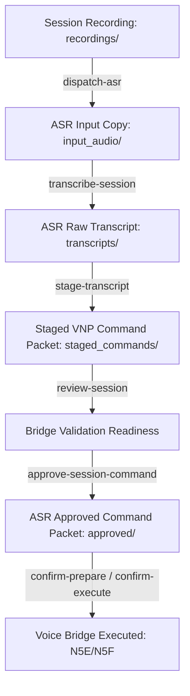

# 🌌 Phase N5H: Voice Session to ASR Pipeline Orchestrator

## 1. Overview & Architecture
The Voice Session to ASR Pipeline Orchestrator (`narrator-voice-asr-orchestrator`) acts as the state synchronization layer between recorded voice sessions and the speech-to-text exact-name command routing loop. It coordinates file handoffs from local recordings to ASR transcription queues, staged command generation, and transcript review readiness.

Crucially, this orchestration layer halts operations at the **ASR Approval** step. It does not auto-dispatch or execute any whitelisted command. Manual confirmation triggers remain strictly controlled by the Voice Bridge confirmation panel (Phase N5F).

---

## 2. Voice-ASR Pipeline Lifecycle Map

---

## 3. Storage Structures & Folder Bindings
All orchestrator metadata and events are stored locally:
- **Orchestrator Reports:** `outputs/narrator/voice_asr_orchestrator/reports/`
- **Orchestrator Logging:** `outputs/narrator/voice_asr_orchestrator/logs/`

---

## 4. Orchestration Security & Safety Controls
1. **ASR Dispatch Locks:** Rejected or archived sessions cannot be staged to ASR. Attempts trigger validation alerts.
2. **Duplicate Dispatch Protection:** Restricts multi-copy operations. If a session is already staged or copied to ASR, repeat requests are blocked.
3. **Command Injection Filters:** Even when approved by the ASR gate, commands are filtered against downstream forbidden characters (`&&`, `;`, `||`, etc.) at the Voice Bridge validation gate before dispatch.
4. **No Auto-Execution Policy:** Under no conditions does this pipeline automatically run command scripts. Execution triggers remain strictly gated behind manual operator confirmation inputs.

---
*Authorized by Sentinel OS Local Operator.*
