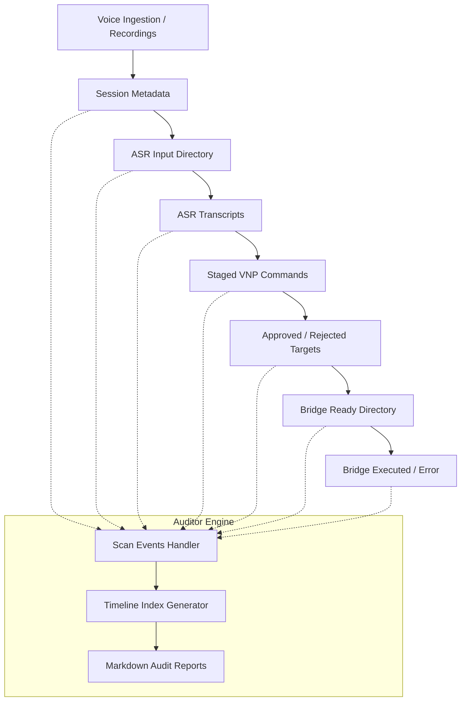

# 📊 Voice Command Lifecycle Audit Timeline (Phase N5I)

This module implements the **Local Voice Command Lifecycle Audit Timeline** for Brilliantaire OS, enabling complete offline visibility, correlation, and safety auditing of voice command transitions.

## 1. Architecture Overview
The lifecycle auditor aggregates history from disconnected directories, log outputs, and metadata buffers. It compiles a sequential timeline tracking a voice command's history from recording ingestion, to transcription, packet staging, ASR validation gates, human bridge preparation, and eventual command router execution.

---

## 2. Lifecycle Timeline Model & Event States
We define standard lifecycle events mapping each stage:

1. **`recording_created`**: The voice session recorder captures microphone input or stages a silent placeholder WAV.
2. **`metadata_written`**: Session parameters (duration, name, timestamps) write to local JSON files.
3. **`asr_dispatched`**: Audio is successfully staged in the ASR intake queue (duplicate-protected).
4. **`transcription_created`**: Whisper synthesizes audio into raw transcript text.
5. **`command_staged`**: The listener extracts command structures and stages a VNP packet.
6. **`asr_approved` / `asr_rejected`**: Operators review and toggle the staged packet's ASR status.
7. **`bridge_prepared`**: The Voice Command Approval Bridge validates routes and signs safety categories.
8. **`bridge_executed` / `bridge_failed`**: The exact-name Command Router attempts execution and captures outputs.
9. **`safety_anomaly`**: An event triggered by fuzzy command names, security injections, or double dispatches.

---

## 3. Local Event Sourcing Approach
To compile timelines without maintaining database dependencies, the script performs directory scanners and log index mappings at runtime:
- Parses timestamps directly from filenames, metadata JSON files, and system generated markdown files.
- Reads `orchestrator.log`, `voice_recorder.log`, `voice_bridge.log`, and `command_log` structures.
- Compiles the gathered states into an in-memory chronological array sorted by event occurrence.
- Writes structured JSON index mappings to `outputs/narrator/voice_lifecycle_audit/index/` for local cache reads.

---

## 4. Safety Event Tracking & No Auto-Execution Policy
- **Read-First Scope**: The auditor operates in a strict read-only model. It does not write, modify, or delete any source recording, transcript, or packet.
- **Auto-Execution Prohibited**: This module does not contain any execution capabilities. It is purely designed for telemetry visualization and offline logs correlation.
- **Safety Flags**: Detects and highlights:
  - Rejected sessions staged for transcription.
  - Fuzzy commands blocked by the router.
  - Command injections caught by bridge validators.
  - Double dispatch block alerts.

---

## 5. Dashboard Integration
The system aggregates these metrics into the Vite React Dashboard, mapping details of the latest session pipeline:
- Latest session ID and progress metrics.
- Active safety flags (Live Mic, Auto-execution blocks).
- Aggregate blocked command attempts.
- Clickable markdown report file paths.
