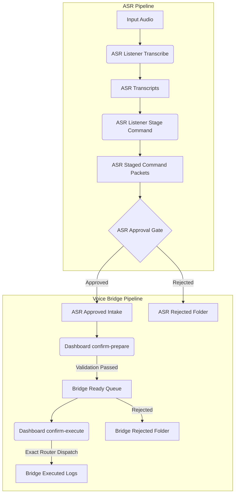

# 🌌 Phase N5F: Voice Loop Dashboard & Human Confirmation UI

The **Voice Loop Dashboard & Human Confirmation UI** establishes central visibility, status reporting, safety auditing, and manual dispatch controls for the offline speech-to-text command loop.

---

## 1. System Architecture

The dashboard compiles data from both the **Local ASR Listener** (Phase N5D) and the **Voice Command Approval Bridge** (Phase N5E) to display the end-to-end voice loop.

---

## 2. Operational Visibility & Controls

The dashboard provides a unified console dashboard through several subcommands:

- **Overview:** Displays file counts across all staging directories and generates a text-based pipeline diagram.
- **Packets:** Lists recent packets in ASR staged, approved, ready, executed, or rejected states.
- **Packet Detail:** Inspects specific packet metadata, raw transcripts, mapped CLI script paths, risk scores, and step-by-step history logs.
- **Pending Confirmations:** Highlights packets currently waiting for operator verification or run triggers.
- **Safety Status:** Verifies that Cloud ASR is disabled, auto-execution is disabled, exact-name command routing is active, and raw shell execution is blocked.
- **Latest Audit:** Prints standard output and standard error logs of the last executed command to ensure visibility.
- **Export Summary:** Writes compiled markdown telemetry summaries to `outputs/narrator/voice_loop_dashboard/reports/`.

---

## 3. Delegation Confirmation Flows

To avoid duplicate code execution and ensure absolute path integrity, the dashboard does **not** execute shell processes directly. It delegates triggers to the Voice Bridge CLI:

1. **`confirm-prepare <ID>`** calls `npm run narrator-voice-bridge -- prepare <ID>` to run security checks and stage the packet to the ready queue.
2. **`confirm-execute <ID>`** calls `npm run narrator-voice-bridge -- execute-approved <ID>` to execute whitelisted exact-name commands.
3. **`reject-packet <ID>`** calls `npm run narrator-voice-bridge -- reject <ID>` to archive the packet as blocked.

This design enforces that the command router safety gate remains the sole executor of system actions.
