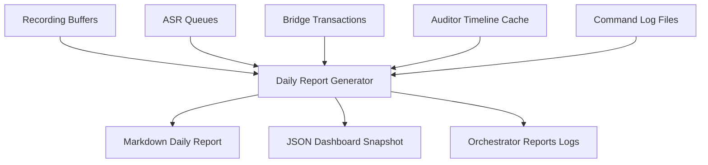

# 📋 Voice Ops Daily Report Generator (Phase N5J)

This module implements the **Local Voice Ops Daily Report Generator** for Brilliantaire OS, compiling consolidated metrics, safety alarms, and risk assessments for the system's voice loop pipeline.

## 1. Architecture Overview
The Daily Report Generator scans all local voice pipeline buffers, audit cache indexes, and command log files. It compiles structured chronological summaries of the current day's operational transitions.

---

## 2. Watched Sources & Metrics Extraction
- **Voice Ingestion**: Scans `outputs/narrator/voice_sessions/` directory.
- **ASR Pipeline**: Scans `outputs/narrator/asr/` directory.
- **Voice Bridge**: Scans `outputs/narrator/voice_bridge/` directory.
- **Auditor Indices**: Extracts from `outputs/narrator/voice_lifecycle_audit/index/`.
- **Interventions / Safety Blocks**: Parses fuzzy command locks, duplicate dispatches, and invalid bridge packets from log streams.

---

## 3. Risk Assessment Logic
The reporter dynamically assesses the loop risk category (Low, Medium, or High):
- **`Low Risk`**: 0 blocked fuzzy command attempts, 0 command injection blocks, and 100% successful/approved states.
- **`Medium Risk`**: 1-5 fuzzy/unconfirmed command blocks, or at least 1 operator rejection.
- **`High Risk`**: More than 5 blocked attempts, or any blocked command injection/malicious validation intervention.

---

## 4. Safety Guardrails & No Auto-Execution Policy
- **Reporting Scope Only**: The daily generator operates strictly in a read-only mode regarding pipeline artifacts. It never starts recording, transcribes audio, approves packets, or runs command router scripts.
- **Transcript Redaction**: Transcripts and execution routes are parsed for previews but are never executed.
- **Local Isolation**: Daily reports remain local to the repository and are excluded from remote check-ins via gitignore rules.
