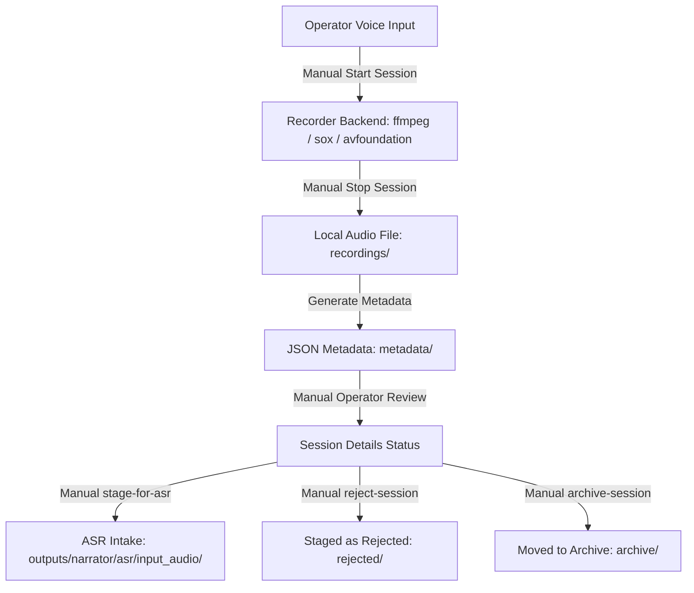

# 🌌 Phase N5G: Local Voice Session Recorder

## 1. Overview & Architecture
The Local Voice Session Recorder (`narrator-voice-session-recorder`) provides the operator with a secure, local-only console command utility to record voice session audio files. Recorded audio and corresponding metadata are stored entirely offline on the local filesystem. These sessions can be manually reviewed, detailed, and staged into the ASR command transcription queue.

This component operates under a strict manual-first, offline-only policy. Automatic transcription, background/always-on voice capturing, cloud API synchronization, and automatic command execution are strictly prohibited to prevent data leakage and command execution compromise.

---

## 2. Voice Pipeline Sequence

---

## 3. Data Storage & Staging Directories
All files reside locally under `outputs/narrator/voice_sessions/`:
- **Recordings Output:** `outputs/narrator/voice_sessions/recordings/`
- **Metadata Output:** `outputs/narrator/voice_sessions/metadata/`
- **Archived Sessions:** `outputs/narrator/voice_sessions/archive/`
- **Rejected Sessions:** `outputs/narrator/voice_sessions/rejected/`
- **Process Logging:** `outputs/narrator/voice_sessions/logs/`
- **ASR Staging Target:** `outputs/narrator/asr/input_audio/`

---

## 4. Strict Safety Enforcement Boundaries
1. **No Always-On Capture:** The microphone is only active between explicit execution of `start-session` and `stop-session` commands. Background recording daemons are banned.
2. **Offline Data Sovereignty:** Absolutely zero network connections, external endpoints, or cloud voice services (e.g., Google Cloud Speech-to-Text, Whisper API) are used.
3. **No Automatic Actions:** Audio files are never automatically transcribed after stop. The staging command `stage-for-asr` must be invoked manually by the operator.
4. **No Auto-Execution:** The voice loop retains the human-in-the-loop validation barrier. Packets staged into ASR must undergo transcript review, bridge staging, and command dispatch confirmations.

---
*Authorized by Sentinel OS Local Operator.*
