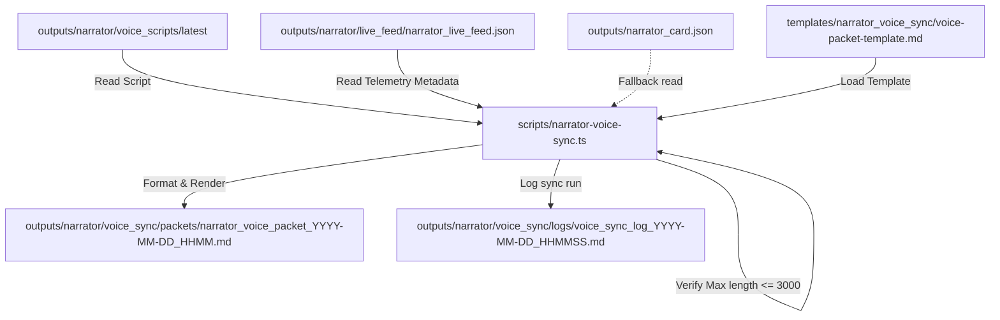
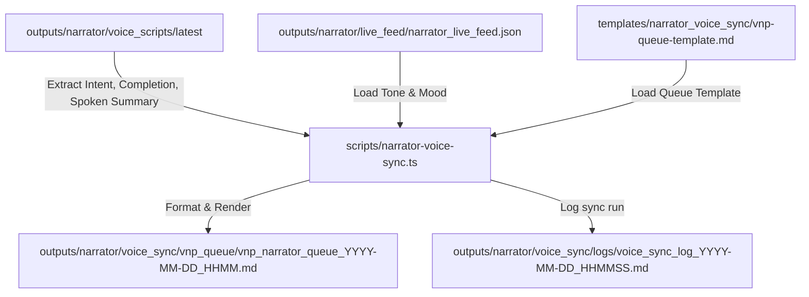

# 🎙️ Phase N4: Voice Narration Sync Layer

The **Voice Narration Sync Layer** converts the latest compiled voice script and live feed into voice-ready packets and Voice Narrative Protocol (VNP) queue files. It operates strictly offline, ensuring a secure boundary between telemetry logs and external audio playback adapters.

---

## 🎯 Purpose
Provide a safe offline staging layer for vocal narratives. The generated packets are designed to feed directly into the local manual review flow, keeping automation pipelines isolated from system mutation commands and external network execution.

---

## 🛡️ Safety & Execution Rules

1. **Output-Only Operations:** The voice sync compiler only reads inputs and writes Markdown deliverables to `outputs/narrator/voice_sync/`. No live voice execution or speech synthesis triggers are executed automatically.
2. **No Command Subprocess Execution:** The layer does not run CLI commands or shell subprocesses. It is strictly sandboxed.
3. **No External TTS API Calls:** Calls to external Speech-to-Text or Text-to-Speech API servers (such as Google Cloud Text-to-Speech, OpenAI TTS, or ElevenLabs) are strictly prohibited in this phase.
4. **No Auto-Playback:** Staged files are flagged with `no_auto_playback: true` or `playback_status: manual_review_required` to block audio triggers without developer confirmation.
5. **No WebSocket Transport:** Live telemetry streaming or real-time event broadcasting to active dashboards is not supported yet.

---

## 🌊 Data Flow Diagrams

### Voice Packet compilation Flow

### VNP queue Flow

---

## 🔮 Future Integration Boundaries

### 📡 Future TTS Bridge Boundary
In subsequent phases, a dedicated `voice-bridge` or `speech-synthesizer` plugin can read enqueued `vnp_narrator_queue` files. This bridge will:
- Require explicit user confirmation through the CLI.
- Run using local, offline speech synthesis models (e.g. Kokoro, Bark, or PyTTSx3) or secured private APIs.
- Keep credentials strictly local.

### 🔌 Future WebSocket Boundary
WebSocket integration will establish a live dashboard listener capable of notifying user interfaces about voice-ready updates. The socket server will:
- Run in a read-only telemetry loop.
- Reject incoming command queries from the frontend.
- Maintain a separate thread to prevent dashboard blocking.
