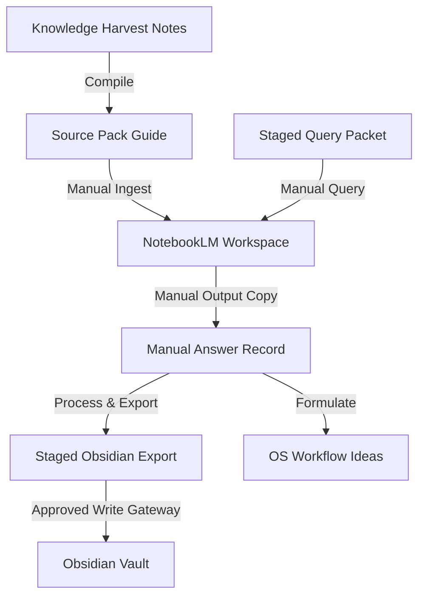

# 📓 NotebookLM MCP Sidecar Bridge

## Purpose
The **NotebookLM MCP Sidecar Bridge** provides a decoupled research interface for **Brilliantaire OS**. It connects local workspace files and Knowledge Ingestion source records to NotebookLM's high-fidelity research vault, translating synthesized findings back into staged files for the OS.

## Sidecar Architecture
The sidecar architecture keeps the main OS execution loop isolated:
- **NotebookLM as Research, Not Execution:** NotebookLM lacks terminal commands access and write credentials. It operates as a read-only research assistant.
- **Manual-First Handoff:** In early iterations, query structures and answer mappings are copy-pasted manually via local markdown staging outputs to ensure safety.
- **Future MCP Adapter Slots:** Configuration mappings and script properties are designed to easily hook into the `notebooklm-mcp` daemon once verified.

## Obsidian Staging Rule
**Direct writing into the Obsidian Vault is strictly forbidden.** All exports compile to `outputs/notebooklm_bridge/obsidian_exports/`. The developer must verify these files and write them to the vault using the standard Approved Obsidian Write Gateway (`npm run command -- "approve-write"`).

## Safety Boundaries
- **Zero API Ingestion in v1:** Network requests to Google or third-party LLM endpoints are disabled by default.
- **Answer Safe-Text Validation:** Ingested files are scanned to block command execution lines (e.g., `sudo`, `rm -rf`, `eval`).
- **Maximum Length Gating:** Manual answers exceeding `12000` characters are rejected to prevent context overflows.
- **No Overwrite:** Unique timestamp suffixes are appended if target files already exist in output paths.

## Supported Commands

| Command | Usage | Description |
|---|---|---|
| `help` | `npm run notebooklm-bridge -- "help"` | Print CLI command options list |
| `create-query` | `npm run notebooklm-bridge -- "create-query <TOPIC>"` | Stages a topic-specific query packet |
| `add-answer` | `npm run notebooklm-bridge -- "add-answer <FILE>"` | Safely imports manually copied answer files |
| `export-obsidian` | `npm run notebooklm-bridge -- "export-obsidian"` | Generates staged Obsidian-ready notes |
| `workflow-ideas` | `npm run notebooklm-bridge -- "workflow-ideas"` | Extracts actionable OS workflow suggestions |
| `source-pack` | `npm run notebooklm-bridge -- "source-pack"` | Compiles knowledge harvest notes into source packs |
| `status` | `npm run notebooklm-bridge -- "status"` | Shows counts of files and diagnostics |
