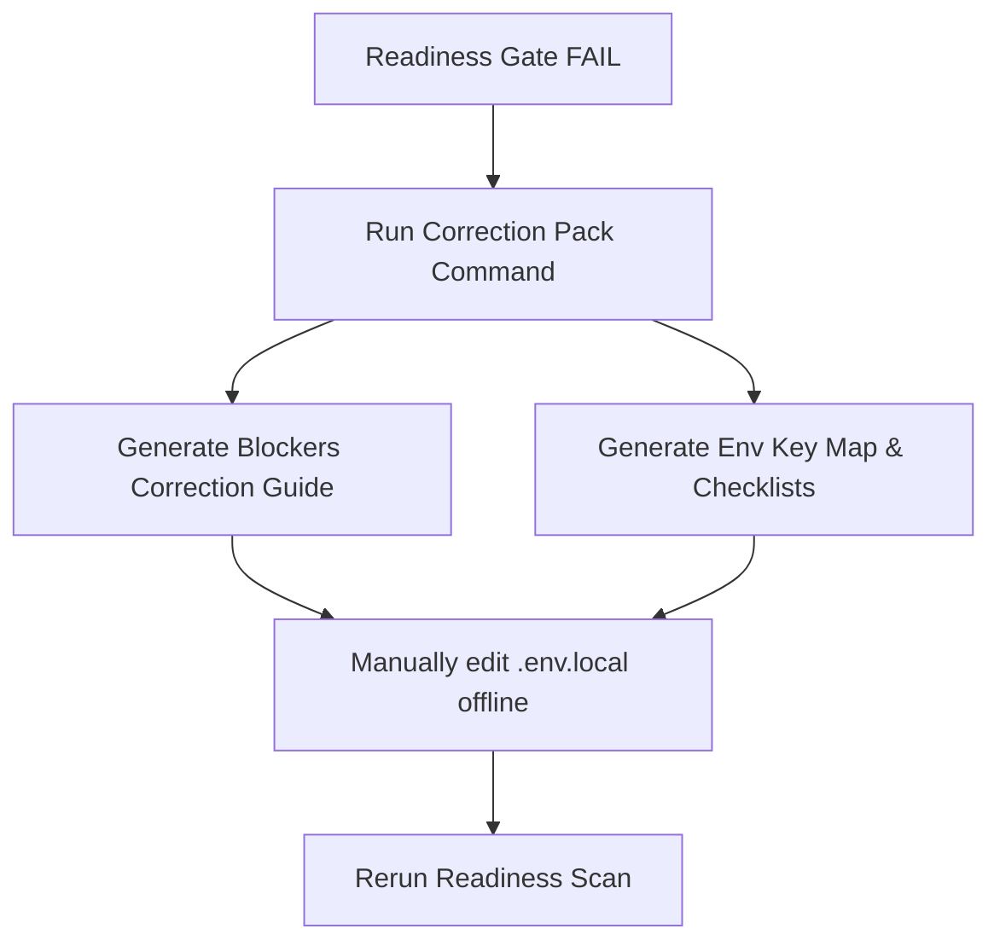
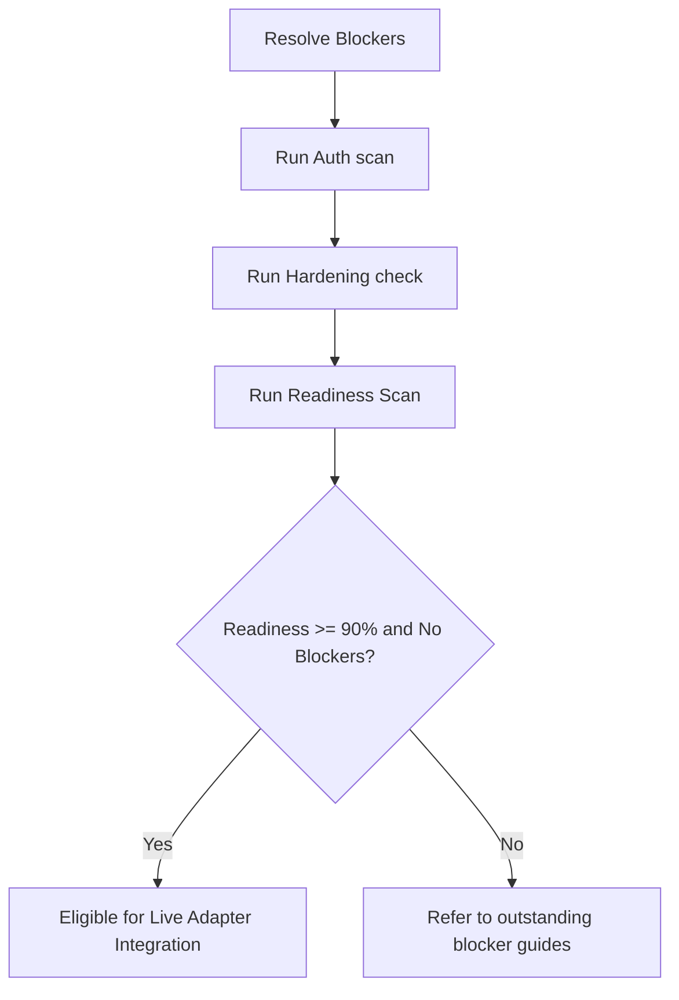

# 🛰️ NotebookLM MCP Local Setup Correction Pack (Phase 11I)

This document outlines the safety guidelines, correction flows, local setup boundaries, and verification runbooks designed to resolve readiness gate blockers outside version control.

## 🎯 Purpose
The Local Setup Correction Pack converts readiness gate blockers into exact manual setup tasks that the operator can perform locally. It guides the user through credentials mapping, configuration setup, and recovery from repository constraints.

## 🛡️ Safety & Execution Rules
1. **No-Secret Rule:** Under no circumstances should plain-text credentials, access tokens, API keys, or project-specific keys be written to files tracked by git.
2. **Local-Only Setup Boundary:** All corrections and environment mappings reside inside ignored configuration files like `.env.local` or `.mcp.local.json`.
3. **Git Push Recovery Boundary:** Direct push errors arising from network limitations are documented for recovery rather than using force pushes without verification.
4. **Live Execution remains blocked:** The live adapter cannot be enabled or initialized until the local readiness gate returns a score of 90%+ and has zero active blockers.

---

## 💻 Available Commands

You can execute these actions safely using the Safe Command Router:

* View correction pack help instructions:
  ```bash
  npm run command -- "notebooklm-mcp-correction-pack-help"
  ```
* Generate blocker correction report:
  ```bash
  npm run command -- "notebooklm-mcp-correction-pack blockers"
  ```
* Generate environment variables key map:
  ```bash
  npm run command -- "notebooklm-mcp-correction-pack env-map"
  ```
* Generate local configuration checklist:
  ```bash
  npm run command -- "notebooklm-mcp-correction-pack local-config"
  ```
* Generate Git push recovery runbook:
  ```bash
  npm run command -- "notebooklm-mcp-correction-pack git-push-recovery"
  ```
* Generate readiness rerun runbook:
  ```bash
  npm run command -- "notebooklm-mcp-correction-pack readiness-rerun"
  ```
* Generate all correction pack documents:
  ```bash
  npm run command -- "notebooklm-mcp-correction-pack all"
  ```
* View overall status summary:
  ```bash
  npm run command -- "notebooklm-mcp-correction-pack status"
  ```

---

## 🧭 Flow Diagrams

### Blocker Correction Flow


### Readiness Rerun Flow

