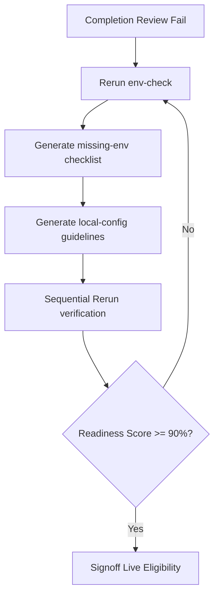

# 🔄 NOTEBOOKLM MCP SETUP FIX CYCLE SPECIFICATION

## 🌌 Purpose & Rationale
The **NotebookLM MCP Setup Fix Cycle** is a local sandbox correction loop designed to guide users through fixing configuration errors, environmental variables discrepancies, and path boundary leaks outside of the version-tracked Git tree.

This procedure follows any **Completion Review Failure** (e.g. when the system readiness score is below 90% or live eligibility is marked as **No**). 

---

## 🛡️ Critical Safety Policies
1. **Absolute Git Hygiene (No-Secret Rule):** Under no circumstances should real secret values, API keys, or GCP credentials be written inside the version-controlled repository files. 
2. **Local-Only Staging:** All configuration overrides must be staged strictly inside local-only, gitignored files (such as `.env.local` or `.env.development`).
3. **Execution Block:** Live adapter execution remains strictly disabled (`ALLOW_LIVE_MCP_EXECUTION = false`) until the readiness recheck score successfully reaches **90%** or higher, and the live eligibility report generates a manual signoff approval signature.

---

## 📋 The Staging Correction Loop

The fix loop consists of four sequential stages:

---

## 🛠️ CLI Task Runner commands

Run the fix cycle and checklist generators using standard workspace task commands:

| Task Command | Action | Output File Location |
| :--- | :--- | :--- |
| `npm run notebooklm-mcp-fix-cycle -- "missing-env"` | Generates environment checklist | `outputs/notebooklm_bridge/mcp_fix_cycle/checklists/notebooklm_missing_env_fix_*.md` |
| `npm run notebooklm-mcp-fix-cycle -- "local-config"` | Generates gitignore and local environment checklist | `outputs/notebooklm_bridge/mcp_fix_cycle/checklists/notebooklm_local_config_fix_*.md` |
| `npm run notebooklm-mcp-fix-cycle -- "rerun-sequence"` | Compiles exact testing commands | `outputs/notebooklm_bridge/mcp_fix_cycle/runbooks/notebooklm_mcp_rerun_sequence_*.md` |
| `npm run notebooklm-mcp-fix-cycle -- "decision-summary"` | Inspects readiness and writes final status | `outputs/notebooklm_bridge/mcp_fix_cycle/reports/notebooklm_mcp_fix_cycle_decision_*.md` |
| `npm run notebooklm-mcp-fix-cycle -- "all"` | Compiles all four fix cycle checklist documents | (Generates all files in parallel) |
| `npm run notebooklm-mcp-fix-cycle -- "status"` | Logs check statuses directly to console | (stdout readout) |

---
*Authorized by Knowledge Librarian under One System Governance Protocol.*
