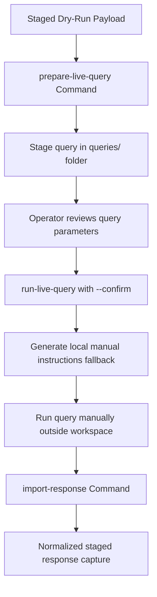

# 🛰️ NotebookLM MCP Live Adapter Integration Guide (Phase 11L)

This document specifies the restricted read-only live integration adapter for **NotebookLM MCP**, enforcing safety boundaries, query staging, readiness gating, and response capturing.

## 🎯 Purpose
The **Live Adapter** enables controlled read-only query dispatch and manual response ingestion to interact safely with NotebookLM.

---

## 🛡️ Safety & Execution Rules

1. **Read-Only Lock:** The adapter operates in strictly read-only mode (`READ_ONLY_MODE = true`).
2. **No Notebook Modification:** Creating, modifying, deleting, or mutating NotebookLM notebooks or sources is strictly forbidden.
3. **No Obsidian Writes:** Query outputs and imported answers reside exclusively inside the local git-ignored outputs directory. They are never written directly to Obsidian.
4. **No Background Query Loops:** All queries must be manually prepared, staged, and executed with operator consent. Automatic background query loops are disabled.
5. **No Secret Printing:** Real connection strings, API tokens, or keys must never be logged or outputted.
6. **Command Confirmation Gate:** Live executions require the exact CLI router command and the explicit addition of the `--confirm` flag.

---

## 💻 CLI Commands

The live adapter is executed through the safe command router:

### 1. View Help Guide
```bash
npm run command -- "notebooklm-mcp-live-help"
```

### 2. Check Status
Summarizes current availability, configurations, env variables presence, and readiness scores.
```bash
npm run command -- "notebooklm-mcp-live status"
```

### 3. Stage Live Query
Reads dry-run payloads and prepares a formatted, staged live query:
```bash
npm run command -- "notebooklm-mcp-live prepare-live-query source-summary"
npm run command -- "notebooklm-mcp-live prepare-live-query workflow-extraction"
```
Staged files are saved under:
`outputs/notebooklm_bridge/live_adapter/queries/`

### 4. Compile Live Readiness Report
Audits secrets readiness score, detection confidence, and environment keys:
```bash
npm run command -- "notebooklm-mcp-live test-readiness"
```
Saves report under:
`outputs/notebooklm_bridge/live_adapter/reports/notebooklm_live_adapter_readiness_YYYY-MM-DD.md`

### 5. Run Live Query (High Risk Confirmation)
Guarded execution. Requires `--confirm` flag, readiness score of 100%, and env enabled flags:
```bash
npm run command -- "notebooklm-mcp-live run-live-query source-summary" --confirm
```

#### 🛡️ Safe Fallback Mechanism
If the precise MCP client-invocation schema/connection contract is unknown or live execution constraints are not met, the script will:
1. Block execution safely.
2. Log the execution as a blocked run report.
3. Generate a manual execution instruction report containing the exact steps, command, and parameters the operator needs to run the query manually.

### 6. Import Manual Response
Imports a manually captured response file from NotebookLM, performing length checks and safety sanitization:
```bash
npm run command -- "notebooklm-mcp-live import-response <path_to_response_file>"
```
Saves imported and normalized records under:
`outputs/notebooklm_bridge/live_adapter/responses/`

### 7. Compile Live Adapter Report
Compiles query staging counts, response metrics, and safety flags status:
```bash
npm run command -- "notebooklm-mcp-live report"
```
Saves report under:
`outputs/notebooklm_bridge/live_adapter/reports/notebooklm_live_adapter_report_YYYY-MM-DD.md`

---

## 🧭 Flow Diagrams

### Live Query Staging & Manual Import Flow

