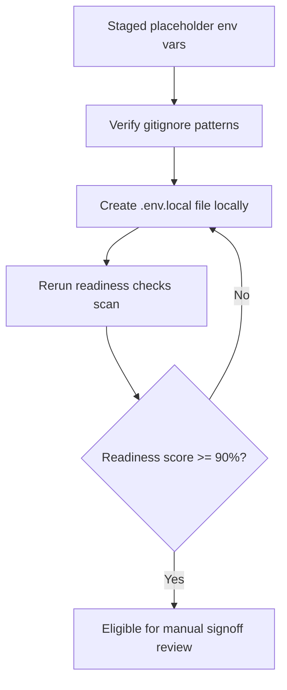

# 🔐 NotebookLM MCP Local Secrets Staging Guide

## 🌌 Purpose & Rationale
The **NotebookLM MCP Local Secrets Staging Guide** establishes a safe, local-only configuration staging boundaries and verification checklists to prepare the system for execution without writing credentials or keys to repository tracked files.

## 🧭 Why Local Secret Staging Follows Phase 11K
Phase 11K established the **Fix Cycle** structure to generate checklists, comparison reports, and next-pass runbooks. Staging local secrets follows Phase 11K directly because resolving the identified configuration errors requires loading credentials safely in local-only environments outside of git control before the readiness score can improve.

---

## 🛡️ Critical Safety Policies

### 1. The No-Secret-in-Repo Rule
Under no circumstances should any raw service account keys, API tokens, passwords, or GCP credentials be written inside the version-controlled repository.

### 2. The `.env.local` Boundary
All credentials must be loaded strictly from `.env.local` in the project root. This file is excluded from Git tracking via `.gitignore` and is reserved only for local execution overrides.

### 3. Gitignore Safety check
Ensure that `.env.local`, `.env`, key files, and service account JSON secrets are explicitly ignored. The system scans `.gitignore` for these patterns:
- `.env`
- `.env.local`
- `*.pem`
- `*.key`
- `*credentials*.json`
- `service-account*.json`

### 4. Locked Live Execution Status
Live adapter execution must remain locked (`ALLOW_LIVE_MCP_EXECUTION = false`) during local staging to prevent accidental external queries. Live execution will only be unlocked in future integration phases.

---

## 📋 Staging and Readiness Rerun Flow
Follow this sequence to test your setup status:

---

## 🛠️ CLI Runner Commands
Run the staging guides and checklists using the following task commands:

| Command | Output File Location | Purpose |
|---|---|---|
| `npm run notebooklm-mcp-local-secrets -- "env-guide"` | `outputs/notebooklm_bridge/mcp_local_secrets/guides/notebooklm_env_local_guide_*.md` | Generates placeholder template overrides |
| `npm run notebooklm-mcp-local-secrets -- "checklist"` | `outputs/notebooklm_bridge/mcp_local_secrets/checklists/notebooklm_local_secret_checklist_*.md` | Compiles secret staging checklist matrix |
| `npm run notebooklm-mcp-local-secrets -- "gitignore-check"` | `outputs/notebooklm_bridge/mcp_local_secrets/reports/notebooklm_gitignore_secret_check_*.md` | Audits gitignore patterns compliance |
| `npm run notebooklm-mcp-local-secrets -- "readiness-rerun"` | `outputs/notebooklm_bridge/mcp_local_secrets/guides/notebooklm_readiness_rerun_after_secret_setup_*.md` | Compiles rerun commands checklist |
| `npm run notebooklm-mcp-local-secrets -- "all"` | (Compiles all guides, checklists, and reports) | Stages complete local secrets runbook suite |
| `npm run notebooklm-mcp-local-secrets -- "status"` | (Prints summary to stdout console) | Audits files presence and recommendations |

---
*Authorized by Knowledge Librarian under One System Governance Protocol.*
