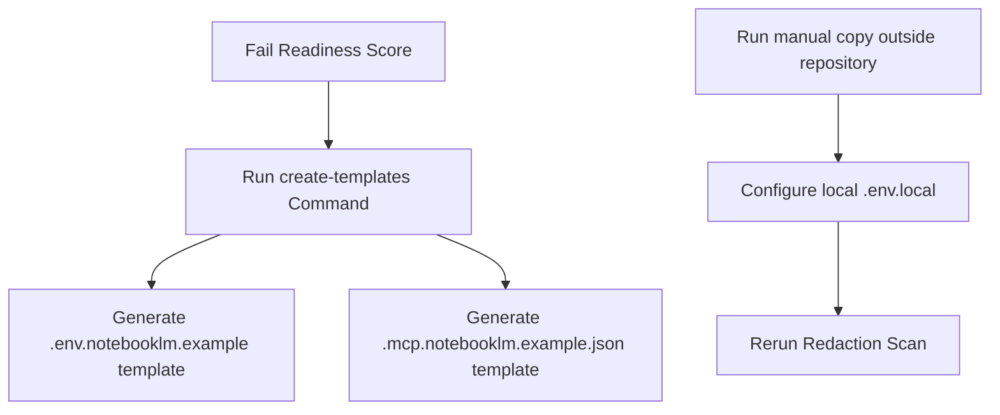

# 🛰️ NotebookLM MCP Local Secrets Staging Guide (Phase 11K)

This document outlines the safety checks, configuration templates, redaction check procedures, and local secrets staging guidelines designed to prepare the NotebookLM MCP integration securely.

## 🎯 Purpose
The Secrets Staging Guide serves as a secure manual framework, allowing operators to configure variables locally without committing credentials to version control or executing active sidecar queries.

## 🛡️ Safety & Redaction Rules
1. **No-Secret-Commit Rule:** Real API tokens, keys, and cloud credentials must never exist in repository code files.
2. **Local-Only Secret Staging:** Environment configuration parameters reside exclusively in git-ignored `.env.local` or `.mcp.local.json` files.
3. **No Env File Writing:** Scripts only generate placeholder templates (`.env.notebooklm.example`). Creating or modifying actual `.env.local` must be performed manually.
4. **Why Live Integration Still Waits:** Local readiness scores default to `0%` inside version control as credentials are kept offline. Live query execution remains disabled.

---

## 🔑 Expected Environment Variables

To activate the NotebookLM MCP Sidecar Bridge locally, the following environment variables are required in the local `.env.local` file:
- `NOTEBOOKLM_MCP_ENABLED`: Enables/disables the integration locally.
- `NOTEBOOKLM_MCP_SERVER_COMMAND`: Absolute command to spawn the local adapter node process.
- `NOTEBOOKLM_AUTH_PROFILE`: Google Cloud configuration profile name.
- `GOOGLE_APPLICATION_CREDENTIALS`: Path to the service account credentials JSON file.
- `GOOGLE_CLOUD_PROJECT`: Target Google Cloud Project ID.
- `NOTEBOOKLM_WORKSPACE_ID`: NotebookLM folder/workspace identifier.

---

## 📁 Local-Only Template Files

The staging guide defines and checks the following template files for local configuration guidance:
1. `.env.notebooklm.example`: Variable placeholder list.
2. `.mcp.notebooklm.example.json`: Model client configuration JSON structure.

These files must contain **placeholder values only**. Real secrets are never written or committed.

---

## 🔍 Codebase Redaction Check

Accidental hardcoding of secret keys in script blocks or documentation is scanned using:
```bash
npm run command -- "notebooklm-mcp-secrets redaction-check"
```
This runs a regex detection rule over all target files and generates:
`outputs/notebooklm_bridge/mcp_secrets/reports/notebooklm_mcp_redaction_check_YYYY-MM-DD.md`

---

## ⏱️ Local Secrets Readiness Gate

The readiness check compiles status criteria into a local report:
`outputs/notebooklm_bridge/mcp_secrets/reports/notebooklm_mcp_local_secrets_readiness_YYYY-MM-DD.md`

It validates:
- `.gitignore` ignores `.env*` local configuration files.
- Example template files are generated.
- Expected variables are documented.
- No plaintext keys are detected by the redaction check.
- Live MCP execution and external API flags are set to `false`.

---

## 🚧 Future Activation Boundary

Until the local readiness score achieves 100% and a manual operator signs off, the adapter remains dormant. Live queries or active server execution will not start.

---

## 💻 Available Commands

You can run these tasks safely via the Safe Command Router:

* View secrets staging help guide:
  ```bash
  npm run command -- "notebooklm-mcp-secrets-help"
  ```
* Create local-only placeholder templates:
  ```bash
  npm run command -- "notebooklm-mcp-secrets create-templates"
  ```
* Scan codebase for accidental plaintext credentials:
  ```bash
  npm run command -- "notebooklm-mcp-secrets redaction-check"
  ```
* Generate local secrets readiness report:
  ```bash
  npm run command -- "notebooklm-mcp-secrets readiness"
  ```
* Print overall status summary:
  ```bash
  npm run command -- "notebooklm-mcp-secrets status"
  ```

---

## 🧭 Flow Diagrams

### Secrets Staging Flow

