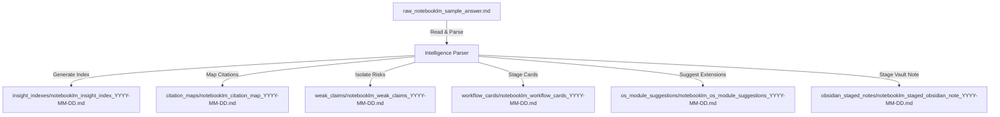

# 🧠 NotebookLM Response Intelligence Processor

## 🌌 Purpose
The **Live Response Intelligence Processor** is a safe, local, offline layer designed to ingest normalized NotebookLM response markdown files and convert them into structured, actionable intelligence cards, maps, suggestions, and staged notes.

By structuring unstructured AI outputs, this module provides the knowledge scaffolding needed to evolve Brilliantaire OS without manual ingestion overhead or risk of database corruption.

---

## 🛠️ Security Boundaries & Constraints
This processor is subject to strict security boundaries. The following policies must be enforced at all times:
1. **Response-Only Processing:** This script only reads local, pre-saved response files.
2. **No Live Queries:** Active NotebookLM live MCP execution or server queries are strictly disabled.
3. **No External APIs:** The processor must never make external API calls (e.g. to Google Cloud, OpenAI, or YouTube).
4. **No Direct Obsidian Writes:** The processor stages markdown notes under `outputs/` for manual review first. Writing directly into the live Obsidian workspace is strictly prohibited.
5. **No File Overwriting:** Output files must use a timestamp suffix if a file with the same name already exists to prevent accidental data loss.

---

## 📋 Staged Intelligence Flow


---

## 📂 Output Types
The processor generates six distinct staged outputs under `outputs/notebooklm_bridge/response_intelligence/`:
- **Insight Indexes:** Chronological logs detailing executive summaries, tools, workflows, strategic opportunities, and next actions.
- **Citation Maps:** Detailed logs mapping citations in the text to source documents, evaluating confidence levels, and raising alerts for missing files.
- **Weak Claims:** Highlighted claims that are risky or unproven (e.g., infinite API quota assumptions) alongside suggested manual verification steps.
- **Workflow Cards:** Standardized operational cards containing steps, required tools, expected benefits, and owner agents.
- **OS Module Suggestions:** Actionable blueprints for new TypeScript modules or utilities to expand Brilliantaire OS capabilities.
- **Obsidian Staged Notes:** Frontmatter-enriched, wikilink-enabled notes tagged and prepared for manual Obsidian vault importation.

---

## ⌨️ Command Reference
Run these commands via the Safe Command Router:

### Help Guide
```bash
npm run command -- "notebooklm-response-intelligence-help"
```

### Run All Processors (Full Run)
```bash
npm run command -- "notebooklm-response-intelligence full"
```

### Run Individual Commands
- **Process Latest:** `npm run command -- "notebooklm-response-intelligence process-latest"`
- **Citation Map:** `npm run command -- "notebooklm-response-intelligence citation-map"`
- **Weak Claims:** `npm run command -- "notebooklm-response-intelligence weak-claims"`
- **Workflow Cards:** `npm run command -- "notebooklm-response-intelligence workflow-cards"`
- **OS Module Suggestions:** `npm run command -- "notebooklm-response-intelligence os-modules"`
- **Obsidian Staged Note:** `npm run command -- "notebooklm-response-intelligence obsidian-note"`
- **Status Summary:** `npm run command -- "notebooklm-response-intelligence status"`

---

## 🔮 Future Grounded Narrator Indexing Boundary
In future phases, the Grounded Narrator will act as the indexing layer, linking these response intelligence files into an active, contextual graph.
The boundaries defined in this phase ensure that the Grounded Narrator will ingest clean, structured, and validated knowledge assets rather than raw, unstructured LLM drafts.
