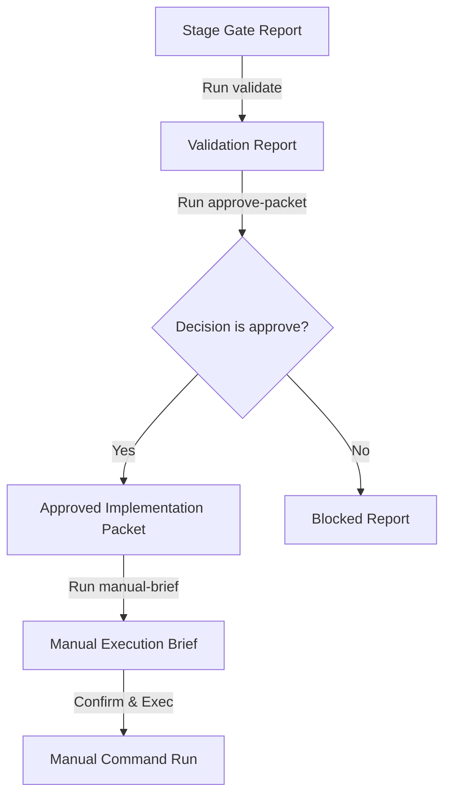

# Pipeline Proposal Approval Router

## Purpose
The Pipeline Proposal Approval Router provides a secure, structured gateway for converting staged build proposals and stage gate reports into verified, manual execution instruction packets. By operating strictly as a validation and staging tool, it prevents automated or arbitrary script/command execution and enforces the strict security boundaries of the **One System**.

## Why Approval Routing Follows Stage Gate
Operating in a multi-agent system requires strict control over how autonomous recommendations are promoted to physical execution tasks. The **Stage Gate (Phase 13E)** creates documentation of proposals, mappings, and prompts. The **Approval Router (Phase 13F)** consumes this package, confirms that the recommended decision matches the authorized `approve` status, and generates a structured handoff (implementation packet and manual brief) for human developers to execute.

## Strict No-Execution Rule
To preserve system sovereignty and prevent privilege escalation or security collisions:
- `ALLOW_SCRIPT_EXECUTION = false`
- `ALLOW_RAW_COMMAND_EXECUTION = false`
- `ALLOW_AUTO_BUILD = false`
- `ALLOW_OBSIDIAN_WRITE = false`
- `ALLOW_NEXT_ACTIONS_AUTO_WRITE = false`

No scripts are triggered. No shells are spawned. No external write modifications occur in the Obsidian note vaults.

## Approval Decision Labels
The router translates strategic recommendations into clear operational decisions:
- **approve:** Resolves to status `approved_for_manual_build`. Generates the implementation packet.
- **revise:** Resolves to status `needs_revision`. Implementation is blocked.
- **reject:** Resolves to status `rejected`. Implementation is blocked.
- **defer:** Resolves to status `deferred`. Implementation is blocked.
- **unknown:** Resolves to status `blocked`. Implementation is blocked.

## Approved Packet Flow


## Manual Execution Boundary
The router marks the end of autonomous routing. The resulting execution packet contains direct instructions, rules, and files for manual execution by a human developer. No automated pipeline runs the generated implementation prompt.

## Command Usage
Execution is routed safely via the Command Router or through the standard scripts:

### Help Menu
```bash
npm run pipeline-approval-router-help
```

### Validate Latest Approval Package
Reads the latest stage-gate approval package and generates a validation report.
```bash
npm run pipeline-approval-router -- "validate"
```

### Create Approved Packet
Parses the validation report and outputs the approved implementation packet (or blocked report).
```bash
npm run pipeline-approval-router -- "approve-packet"
```

### Generate Manual Execution Brief
Prepares the manual execution instructions, including not-allowed rules and prompt targets.
```bash
npm run pipeline-approval-router -- "manual-brief"
```

### Inquire Status
Summary of active stage gate files, approval packet status, and configuration details.
```bash
npm run pipeline-approval-router -- "status"
```

## Outputs
All files are saved with a timestamp suffix when naming collisions occur:
- Reports: `outputs/knowledge_harvest/pipeline_approval_router/reports/`
- Packets: `outputs/knowledge_harvest/pipeline_approval_router/approved_packets/`
- Log Trail: `outputs/knowledge_harvest/pipeline_approval_router/logs/`

## Future Implementation Boundary
Future phases will implement sandboxed orchestration and human confirmation verification, but the *Pipeline Proposal Approval Router* will remain the formal documentation gateway, assuring compliance to safety parameters.
