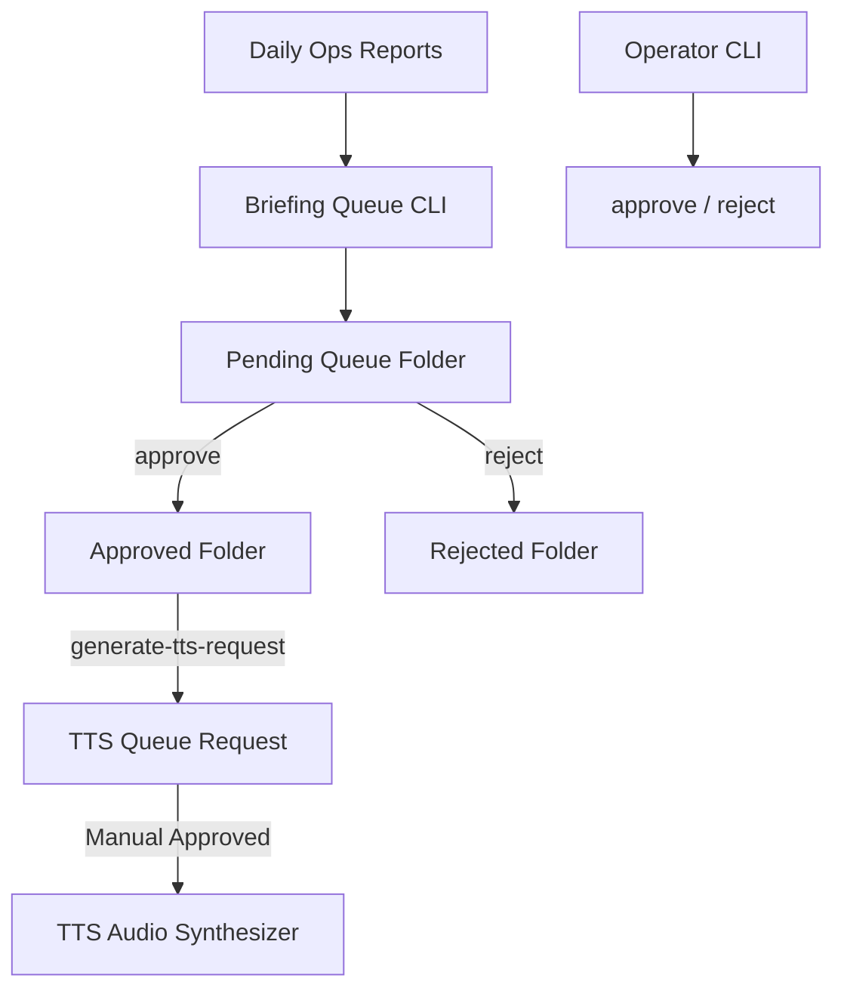

# 📋 Voice Ops Scheduled Briefing Queue (Phase N5K)

This module implements the **Local Scheduled Briefing Queue** for Sentinel OS / One System, enabling daily operating reports to be staged, validated, approved, and prepared for offline speech synthesis.

## 1. Architecture Overview
The Scheduled Briefing Queue acts as a buffer between the Daily Report Generator (Phase N5J) and the TTS Render Queue (Phase N5A). It ensures that no audio rendering or narration occurs without manual confirmation.

---

## 2. Watched Sources & Directories
- **Reports Source**: Scans `outputs/narrator/voice_ops_daily_report/reports` for operating reports.
- **Queue Directory**: Staged briefing files are placed in `outputs/narrator/voice_ops_scheduled_briefing/queue`.
- **Approved/Rejected**: Stored in corresponding folders under `outputs/narrator/voice_ops_scheduled_briefing/`.
- **TTS Requests**: Placed in `outputs/narrator/voice_ops_scheduled_briefing/tts_requests` and mapped to `outputs/narrator/tts_queue/requests/` to interface with the TTS system.

---

## 3. Manual Approval Gate & No Auto-Execution Policy
1. **Read-Only Scheduling**: Creating a briefing item or staging a job does not automatically generate audio, start recordings, or execute voice commands.
2. **Explicit Approval Gate**: An item in the queue must be explicitly transitioned to `approved` status before a TTS request can be compiled.
3. **No Automatic synthesis**: The `generate-tts-request` command only creates a TTS rendering queue packet. The actual synthesis is deferred to the TTS Approval and Renderer Flow (N5A/N5B).
4. **Local Containment**: All logs, briefings, and queues are maintained locally within the repository and excluded from remote check-ins.

---

## 4. Operational Commands
- `status`: Show queue health, configurations, and pending briefing count.
- `create-daily`: Stage a briefing queue item from today's latest Voice Ops Daily Report.
- `create-date <YYYY-MM-DD>`: Stage a briefing queue item from a specific date report.
- `list-queue`: List pending, approved, rejected, and TTS-requested briefings.
- `inspect <BRIEFING_ID>`: View briefing report details, risk levels, and proposed TTS request text.
- `approve <BRIEFING_ID>`: Move pending briefing to approved queue.
- `reject <BRIEFING_ID>`: Move pending briefing to rejected queue.
- `generate-tts-request <BRIEFING_ID>`: Create a narrator TTS request packet for an approved briefing item.
- `queue-summary`: Compile queue metrics and status into a Markdown summary.
- `latest`: Print details of the newest briefing queue item.
- `briefing-log`: Print briefing event logs.

---
## 5. Footer
“I build before burning.”
