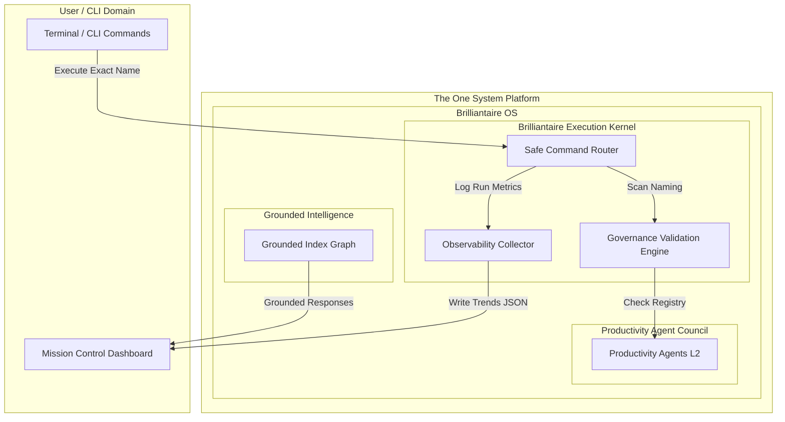

# 📡 Brilliantaire OS: v1.0 Architecture Baseline Specification

This document establishes the official **Brilliantaire OS v1.0 Architecture Baseline**, defining the canonical subsystems, service registries, boundaries, and extension frameworks.

- **Semantic Version:** `v1.0.0-baseline`
- **Authorized Oversight:** OS Architect & Independent Systems Auditor

---

## 🏛️ 1. Canonical Architecture Diagram

The v1.0 architecture maps execution layers across isolated security boundaries:



---

## 🛡️ 2. System Boundaries

*   **Platform Boundary**: **The One System** is a distributed platform coordinate. **Brilliantaire OS** is the local tactical operating system executing on macOS.
*   **Kernel Boundary**: **Brilliantaire Execution Kernel** manages script lifecycles and subprocesses.
*   **State Isolation Boundary (Collision Isolation Protocol)**:
    *   `.gemini/`: Custom plugin CLI directories.
    *   `.agents/`: Sovereign stack global specifications.
    *   `outputs/`: Staged local telemetry reports and logs.

---

## 🗃️ 3. Core Subsystem Inventory

1.  **Platform**: The One System
2.  **Operating System**: Brilliantaire OS
3.  **Kernel**: Brilliantaire Execution Kernel
4.  **Safe Command Router**: Subprocess exact-name gatekeeper.
5.  **Governance validation engine**: Checks configuration compliance.
6.  **Observability collector**: Gathers performance metrics historically.
7.  **Production readiness engine**: Computes release metrics.
8.  **VibeVoice Vocal Bridge**: Connects audio transcription to incoming system mailboxes.

---

## 🔌 4. Extension Framework Interfaces (Design Spec)

To allow safe plugin integrations without direct coupling, future subsystems must implement the following interfaces:

### A. Skill Integration Contract
```typescript
export interface IPlatformSkill {
  id: string;
  name: string;
  version: string;
  activate(context: IPlatformContext): Promise<void>;
  deactivate(): Promise<void>;
}
```

### B. Agent Integration Contract
```typescript
export interface IPlatformAgent {
  id: string;
  role: string;
  supportedModels: string[];
  executeTask(task: IPlatformTask): Promise<ITaskResponse>;
}
```

---

## 🧯 5. Long Term Maintenance Strategy

*   **Release Cadence**: Semantic versioning rules (`MAJOR.MINOR.PATCH`). Releases occur in 2-week validation cycles.
*   **Deprecation Policy**: Obsolete components must be marked `status: 'deprecated'` inside [config/canonical-registry.ts](file:///Users/alexanderanthony/Projects/antigravity-lab/one-system/brilliantaire-os/config/canonical-registry.ts) for 1 minor version before deletion.
*   **Disaster Recovery**: Weekly backup snapshots of `outputs/` telemetry to the `.archive/` directory.

---
*Authorized by the Brilliantaire OS Architecture Council*
